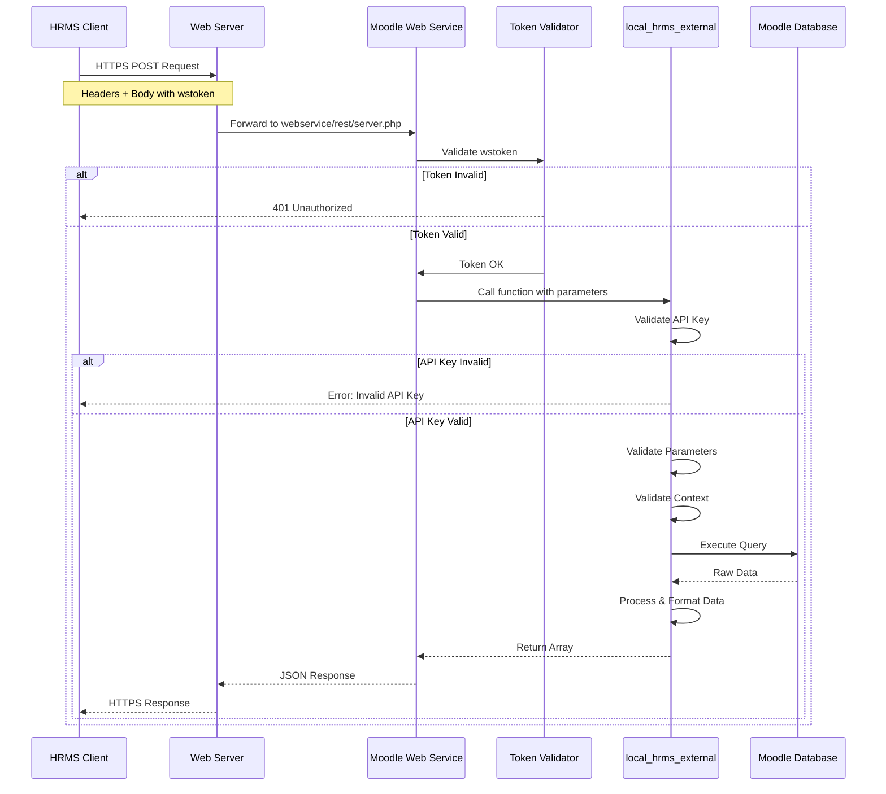
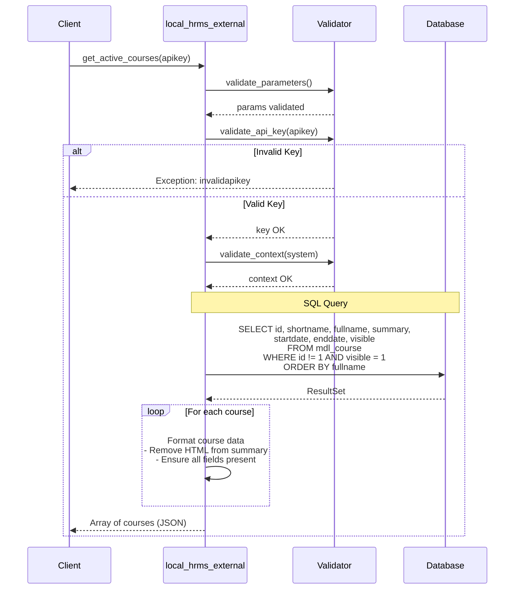
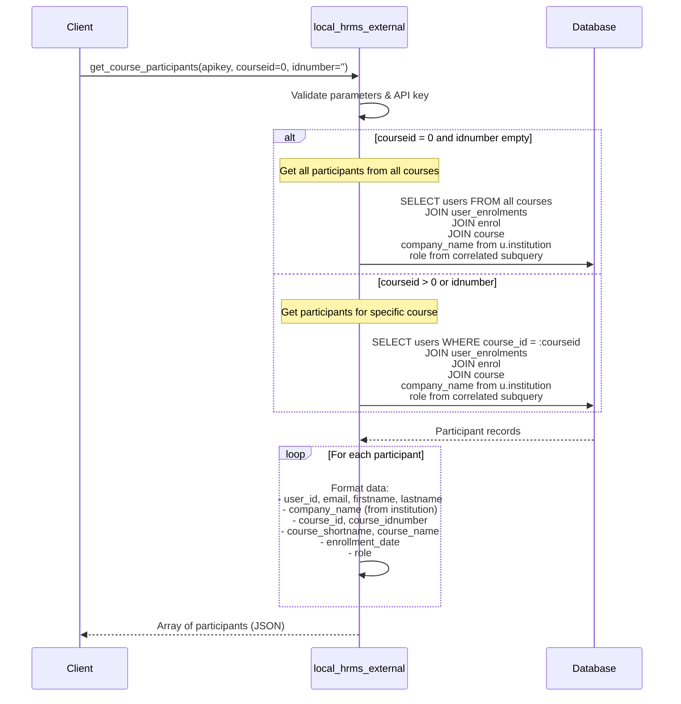
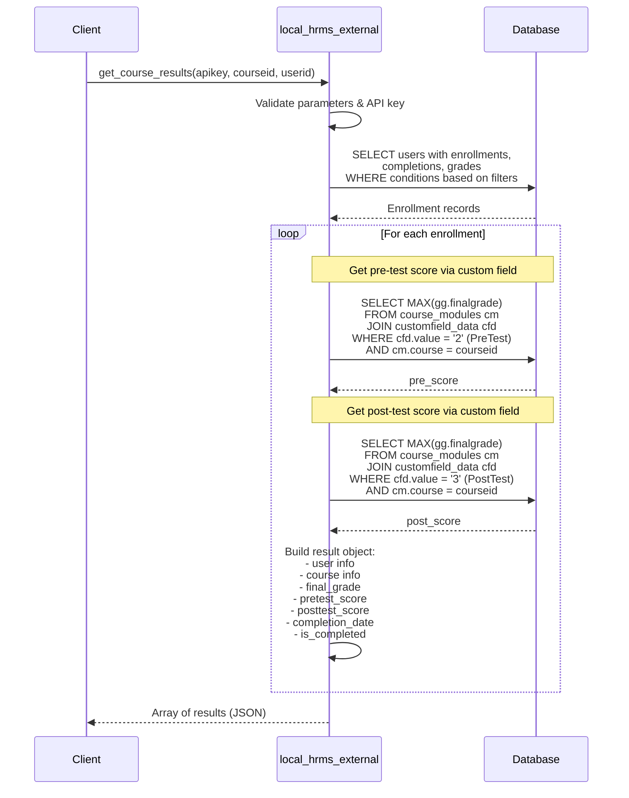
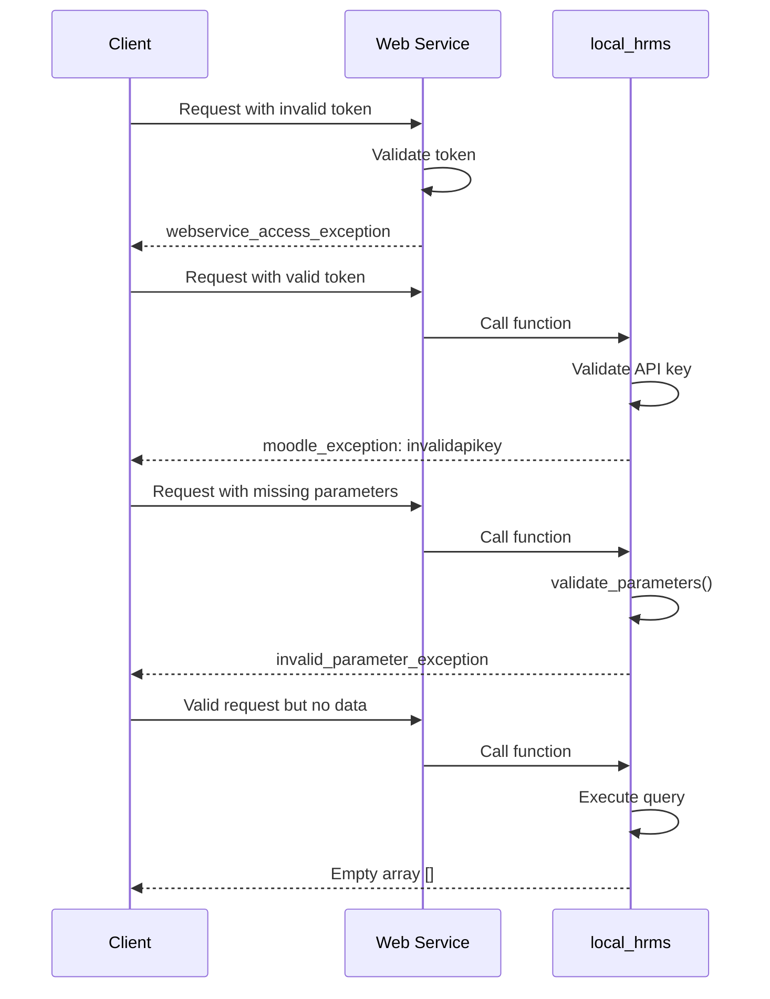
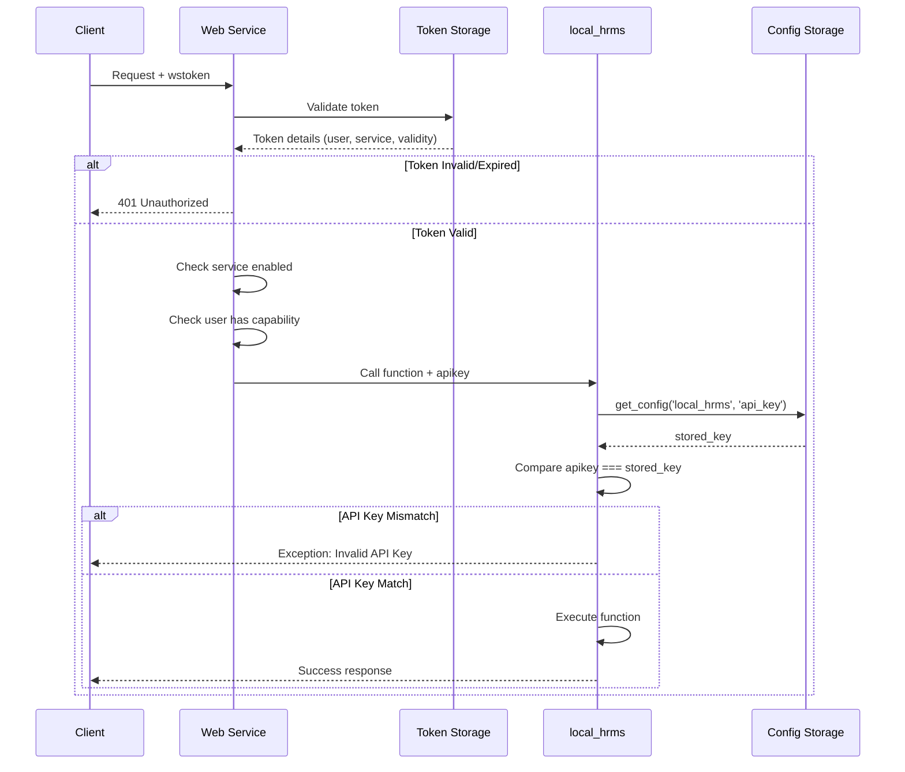

# HRMS Plugin - Design Documentation

## Table of Contents
1. [System Architecture](#system-architecture)
2. [Component Design](#component-design)
3. [Sequence Diagrams](#sequence-diagrams)
4. [Database Design](#database-design)
5. [Security Architecture](#security-architecture)
6. [API Design Patterns](#api-design-patterns)

---

## System Architecture

### High-Level Architecture

```
┌─────────────────────────────────────────────────────────────┐
│                    External Integration                      │
│                      (HRMS System)                           │
└────────────────────────┬────────────────────────────────────┘
                         │
                         │ HTTPS/REST
                         │ (POST requests)
                         ▼
┌─────────────────────────────────────────────────────────────┐
│                    Web Server Layer                          │
│                  (Apache/Nginx + SSL)                        │
└────────────────────────┬────────────────────────────────────┘
                         │
                         ▼
┌─────────────────────────────────────────────────────────────┐
│              Moodle Core Web Service Layer                   │
│                                                              │
│  ┌──────────────────────────────────────────────────┐      │
│  │  REST Protocol Handler                            │      │
│  │  - Parse incoming requests                        │      │
│  │  - Validate web service token                     │      │
│  │  - Route to appropriate function                  │      │
│  │  - Format response (JSON/XML)                     │      │
│  └────────────────────┬─────────────────────────────┘      │
│                       │                                      │
└───────────────────────┼──────────────────────────────────────┘
                        │
                        ▼
┌─────────────────────────────────────────────────────────────┐
│                 local_hrms Plugin Layer                      │
│                                                              │
│  ┌──────────────────────────────────────────────────┐      │
│  │  local_hrms_external Class                        │      │
│  │                                                    │      │
│  │  1. API Key Validation                            │      │
│  │  2. Parameter Validation                          │      │
│  │  3. Context Validation                            │      │
│  │  4. Business Logic Execution                      │      │
│  │  5. Data Formatting                               │      │
│  └────────────────────┬─────────────────────────────┘      │
│                       │                                      │
└───────────────────────┼──────────────────────────────────────┘
                        │
                        ▼
┌─────────────────────────────────────────────────────────────┐
│                  Moodle Data Layer                           │
│                                                              │
│  ┌──────────────┐  ┌──────────────┐  ┌──────────────┐     │
│  │   Courses    │  │    Users     │  │    Grades    │     │
│  │   Table      │  │    Table     │  │    Table     │     │
│  └──────────────┘  └──────────────┘  └──────────────┘     │
│                                                              │
│  ┌──────────────┐  ┌──────────────┐  ┌──────────────┐     │
│  │ Enrollments  │  │ Completions  │  │    Quiz      │     │
│  │   Table      │  │    Table     │  │  Attempts    │     │
│  └──────────────┘  └──────────────┘  └──────────────┘     │
└─────────────────────────────────────────────────────────────┘
```

### Request Flow Diagram

```
┌──────────┐
│  HRMS    │
│ System   │
└────┬─────┘
     │
     │ 1. POST Request
     │    - wstoken
     │    - wsfunction
     │    - apikey
     │    - parameters
     ▼
┌─────────────────┐
│  Moodle Web     │
│  Service Layer  │──────────► Validate Token
└────┬────────────┘              │
     │                            │ Valid?
     │◄───────────────────────────┘
     │
     │ 2. Route to Function
     ▼
┌─────────────────┐
│  local_hrms_    │
│  external       │──────────► Validate API Key
└────┬────────────┘              │
     │                            │ Valid?
     │◄───────────────────────────┘
     │
     │ 3. Execute Business Logic
     ▼
┌─────────────────┐
│  Database       │
│  Queries        │
└────┬────────────┘
     │
     │ 4. Process Results
     ▼
┌─────────────────┐
│  Format         │
│  Response       │
└────┬────────────┘
     │
     │ 5. Return JSON/XML
     ▼
┌──────────┐
│  HRMS    │
│ System   │
└──────────┘
```

---

## Component Design

### Class Diagram

```
┌─────────────────────────────────────────────────────────────┐
│              external_api (Moodle Core)                     │
│                                                             │
│  + validate_parameters()                                    │
│  + validate_context()                                       │
└────────────────────────┬────────────────────────────────────┘
                         │
                         │ extends
                         ▼
┌─────────────────────────────────────────────────────────────┐
│                 local_hrms_external                         │
├─────────────────────────────────────────────────────────────┤
│  Static Methods (Read):                                     │
│                                                             │
│  + get_active_courses_parameters()                          │
│  + get_active_courses(apikey, courseid, idnumber)           │
│  + get_active_courses_returns()                             │
│                                                             │
│  + get_course_participants_parameters()                     │
│  + get_course_participants(apikey, courseid, idnumber)      │
│  + get_course_participants_returns()                        │
│                                                             │
│  + get_course_results_parameters()                          │
│  + get_course_results(apikey, courseid, userid, idnumber)   │
│  + get_course_results_returns()                             │
│                                                             │
│  + get_users_parameters()                                   │
│  + get_users(apikey, status, email)                         │
│  + get_users_returns()                                      │
│                                                             │
│  + get_course_progress_parameters()                         │
│  + get_course_progress(apikey, courseid, idnumber,          │
│                         userid, email)                      │
│  + get_course_progress_returns()                            │
│                                                             │
│  Static Methods (Write):                                    │
│                                                             │
│  + set_user_suspension_parameters()                         │
│  + set_user_suspension(apikey, userid, email, suspended)    │
│  + set_user_suspension_returns()                            │
│                                                             │
│  + create_course_parameters()                               │
│  + create_course(apikey, fullname, shortname, idnumber, …)  │
│  + create_course_returns()                                  │
│                                                             │
│  + update_course_parameters()                               │
│  + update_course(apikey, idnumber, …)                       │
│  + update_course_returns()                                  │
│                                                             │
│  + create_user_parameters()                                 │
│  + create_user(apikey, username, email, …)                  │
│  + create_user_returns()                                    │
│                                                             │
│  + update_user_parameters()                                 │
│  + update_user(apikey, userid, email, …)                    │
│  + update_user_returns()                                    │
│                                                             │
│  + enrol_user_parameters()                                  │
│  + enrol_user(apikey, userid, email, courseid, idnumber,    │
│               role)                                         │
│  + enrol_user_returns()                                     │
│                                                             │
│  + unenrol_user_parameters()                                │
│  + unenrol_user(apikey, userid, email, courseid, idnumber)  │
│  + unenrol_user_returns()                                   │
│                                                             │
│  Private Helper Methods:                                    │
│                                                             │
│  - validate_api_key(apikey) : bool                          │
│  - get_quiz_score(userid, courseid, type)  [unused/reserved]│
│  - get_questionnaire_scores(userid, courseid)               │
└─────────────────────────────────────────────────────────────┘
```

### Function Pattern

Each API function follows this pattern:

```php
// 1. Parameter Definition
public static function {function_name}_parameters() {
    return new external_function_parameters([
        'param1' => new external_value(TYPE, 'Description'),
        'param2' => new external_value(TYPE, 'Description', VALUE_OPTIONAL, default)
    ]);
}

// 2. Function Implementation
public static function {function_name}($param1, $param2 = default) {
    // 2.1 Validate parameters
    $params = self::validate_parameters(
        self::{function_name}_parameters(), 
        ['param1' => $param1, 'param2' => $param2]
    );
    
    // 2.2 Validate API key
    if (!self::validate_api_key($params['apikey'])) {
        throw new moodle_exception('invalidapikey', 'local_hrms');
    }
    
    // 2.3 Validate context
    $context = context_system::instance();
    self::validate_context($context);
    
    // 2.4 Execute business logic
    $result = // ... database queries and processing
    
    // 2.5 Return formatted data
    return $result;
}

// 3. Return Value Definition
public static function {function_name}_returns() {
    return new external_multiple_structure(
        new external_single_structure([
            'field1' => new external_value(TYPE, 'Description'),
            'field2' => new external_value(TYPE, 'Description')
        ])
    );
}
```

### Helper Methods

The plugin also includes private helper methods for complex operations:

```php
/**
 * Validate API key
 */
private static function validate_api_key($apikey) {
    $stored_key = get_config('local_hrms', 'api_key');
    return !empty($stored_key) && $apikey === $stored_key;
}

/**
 * Get quiz score based on custom field
 * @param int $userid User ID
 * @param int $courseid Course ID
 * @param string $type 'pre' or 'post'
 * @return float Quiz score
 */
private static function get_quiz_score($userid, $courseid, $type) {
    global $DB;
    
    // fieldvalue: 2 = PreTest, 3 = PostTest
    $fieldvalue = $type === 'pre' ? '2' : '3';
    
    $sql = "SELECT MAX(gg.finalgrade) as score
            FROM {course_modules} cm
            JOIN {modules} m ON m.id = cm.module AND m.name = 'quiz'
            JOIN {customfield_data} cfd ON cfd.instanceid = cm.id 
            JOIN {grade_items} gi ON gi.iteminstance = cm.instance
            LEFT JOIN {grade_grades} gg ON gg.itemid = gi.id AND gg.userid = :userid
            WHERE cm.course = :courseid AND cfd.value = :fieldvalue";
    
    $result = $DB->get_record_sql($sql, [
        'userid' => $userid,
        'courseid' => $courseid,
        'fieldvalue' => $fieldvalue
    ]);
    
    return $result && $result->score ? round($result->score, 2) : 0.00;
}

/**
 * Get questionnaire scores for a user in a course
 * @param int $userid User ID
 * @param int $courseid Course ID
 * @return array Associative array with questionnaire scores
 */
private static function get_questionnaire_scores($userid, $courseid) {
    global $DB;
    
    // Default response structure
    $default = [
        'questionnaire_available' => 0,
        'score_materi' => 0.00,
        'score_trainer' => 0.00,
        'score_fasilitas' => 0.00,
        'score_total' => 0.00
    ];
    
    try {
        // Find questionnaire, Rate question, count choices
        // Get user responses ordered by choice_id
        // Calculate scores based on choice count
        // Return scores with proper rounding
        
        // If exactly 9 choices: calculate materi, trainer, tempat
        // Otherwise: only calculate score_total
        
    } catch (Exception $e) {
        error_log("Questionnaire error: " . $e->getMessage());
        return $default;
    }
}
```

---

## Sequence Diagrams

### 1. Complete Request-Response Cycle



### 2. Get Active Courses - Detailed Flow



### 3. Get Course Participants - Detailed Flow



### 4. Get Course Results - Detailed Flow



### 5. Error Handling Flow



---

## Database Design

### Entity Relationship Diagram

```
┌─────────────────┐         ┌─────────────────┐
│     Course      │         │      User       │
├─────────────────┤         ├─────────────────┤
│ id (PK)         │         │ id (PK)         │
│ shortname       │         │ email           │
│ fullname        │         │ firstname       │
│ summary         │         │ lastname        │
│ startdate       │         │ deleted         │
│ enddate         │         │ confirmed       │
│ visible         │         └────────┬────────┘
└────────┬────────┘                  │
         │                           │
         │ 1                         │ 1
         │                           │
         │         N        N        │
         └──────┐         ┌─────────┘
                │         │
                ▼         ▼
         ┌──────────────────────┐
         │   User_enrolments    │
         ├──────────────────────┤
         │ id (PK)              │
         │ enrolid (FK)         │
         │ userid (FK)          │
         │ timecreated          │
         └──────────┬───────────┘
                    │
                    │ N
                    │
                    │ 1
                    ▼
         ┌──────────────────────┐
         │       Enrol          │
         ├──────────────────────┤
         │ id (PK)              │
         │ courseid (FK)        │
         │ enrol                │
         │ status               │
         └──────────────────────┘

┌─────────────────┐         ┌─────────────────┐
│ Course_         │         │  Grade_items    │
│ Completions     │         ├─────────────────┤
├─────────────────┤         │ id (PK)         │
│ userid (FK)     │         │ courseid (FK)   │
│ course (FK)     │         │ itemtype        │
│ timecompleted   │         └────────┬────────┘
└─────────────────┘                  │
                                     │ 1
                                     │
                                     │ N
                                     ▼
                          ┌─────────────────┐
                          │  Grade_grades   │
                          ├─────────────────┤
                          │ id (PK)         │
                          │ itemid (FK)     │
                          │ userid (FK)     │
                          │ finalgrade      │
                          └─────────────────┘

┌─────────────────┐         ┌─────────────────┐
│      Quiz       │         │  Quiz_attempts  │
├─────────────────┤         ├─────────────────┤
│ id (PK)         │──1:N────│ quiz (FK)       │
│ course (FK)     │         │ userid (FK)     │
│ name            │         │ sumgrades       │
└─────────────────┘         │ state           │
                            └─────────────────┘

┌─────────────────┐         ┌─────────────────┐
│ User_info_field │         │ User_info_data  │
├─────────────────┤         ├─────────────────┤
│ id (PK)         │──1:N────│ userid (FK)     │
│ shortname       │         │ fieldid (FK)    │
│ name            │         │ data            │
└─────────────────┘         └─────────────────┘

┌──────────────────┐         ┌──────────────────┐
│ Questionnaire    │         │ Questionnaire_   │
├──────────────────┤         │ Question         │
│ id (PK)          │──1:N────├──────────────────┤
│ course (FK)      │         │ id (PK)          │
│ name             │         │ surveyid (FK)    │
└──────────────────┘         │ type_id          │
                             │ (8=QUESRATE)     │
                             └────────┬─────────┘
                                      │ 1
                                      │
                                      │ N
                             ┌────────┴─────────┐
                             │ Questionnaire_   │
                             │ Quest_Choice     │
                             ├──────────────────┤
                             │ id (PK)          │
                             │ question_id (FK) │
                             │ content          │
                             └──────────────────┘

┌──────────────────┐         ┌──────────────────┐
│ Questionnaire_   │         │ Questionnaire_   │
│ Response         │         │ Response_Rank    │
├──────────────────┤         ├──────────────────┤
│ id (PK)          │──1:N────│ response_id (FK) │
│ questionnaireid  │         │ question_id (FK) │
│ userid (FK)      │         │ choice_id (FK)   │
└──────────────────┘         │ rankvalue        │
                             └──────────────────┘

┌──────────────────┐         ┌──────────────────┐
│ Customfield_     │         │ Customfield_     │
│ Field            │         │ Data             │
├──────────────────┤         ├──────────────────┤
│ id (PK)          │──1:N────│ fieldid (FK)     │
│ shortname        │         │ instanceid (FK)  │
│ (jenis_quiz)     │         │ value            │
└──────────────────┘         │ (2=Pre, 3=Post)  │
                             └──────────────────┘
```

### Key Queries

#### Query 1: Active Courses
```sql
SELECT
    c.id,
    c.idnumber,
    c.shortname,
    c.fullname,
    c.summary,
    c.startdate,
    c.enddate,
    c.visible,
    cc.id   AS category_id,
    cc.name AS category_name,
    COALESCE(cfd.value, '') AS jp
FROM mdl_course c
JOIN mdl_course_categories cc
    ON cc.id = c.category
LEFT JOIN mdl_customfield_category cfc
    ON cfc.component = 'core_course' AND cfc.area = 'course'
LEFT JOIN mdl_customfield_field cff
    ON cff.shortname = 'jp' AND cff.categoryid = cfc.id
LEFT JOIN mdl_customfield_data cfd
    ON cfd.instanceid = c.id AND cfd.fieldid = cff.id
WHERE c.id != 1
  AND c.visible = 1
  [AND c.id = :courseid]       -- Optional filter by course ID
  [AND c.idnumber = :idnumber] -- Optional filter by ID number
ORDER BY cc.name, c.fullname;
```

#### Query 2: Course Participants
```sql
SELECT CONCAT(u.id, '-', c.id) AS id,
    u.id                           AS user_id,
    u.email,
    u.firstname,
    u.lastname,
    COALESCE(u.institution, '')    AS company_name,
    c.id                           AS course_id,
    c.idnumber                     AS course_idnumber,
    c.shortname,
    c.fullname                     AS course_name,
    ue.timecreated                 AS enrollment_date,
    COALESCE((
        SELECT r.shortname
        FROM mdl_role_assignments ra
        JOIN mdl_context ctx
            ON ctx.id = ra.contextid AND ctx.contextlevel = 50
        JOIN mdl_role r ON r.id = ra.roleid
        WHERE ra.userid = u.id AND ctx.instanceid = c.id
        ORDER BY r.sortorder ASC
        LIMIT 1
    ), '') AS role
FROM mdl_user u
JOIN mdl_user_enrolments ue ON u.id = ue.userid
JOIN mdl_enrol e ON ue.enrolid = e.id
JOIN mdl_course c ON e.courseid = c.id
WHERE u.deleted = 0
  AND u.confirmed = 1
  AND c.id != 1
  AND c.visible = 1
  [AND c.id = :courseid]       -- Optional filter by course ID
  [AND c.idnumber = :idnumber] -- Optional filter by ID number
ORDER BY c.fullname, u.lastname, u.firstname;

-- Note: company_name is sourced from mdl_user.institution field
-- Note: role uses correlated subquery to retrieve the user's highest-priority
--       role in the course context
```

#### Query 3: Course Results
```sql
SELECT CONCAT(u.id, '-', c.id) AS id,
    u.id                        AS user_id,
    u.email,
    u.firstname,
    u.lastname,
    COALESCE(u.institution, '') AS company_name,
    c.id                        AS course_id,
    c.idnumber                  AS course_idnumber,
    c.shortname,
    c.fullname                  AS course_name,
    cc.timecompleted,
    COALESCE(gg.finalgrade, 0)  AS final_grade
FROM mdl_user u
JOIN mdl_user_enrolments ue ON u.id = ue.userid
JOIN mdl_enrol e ON ue.enrolid = e.id
JOIN mdl_course c ON e.courseid = c.id
LEFT JOIN mdl_course_completions cc
    ON u.id = cc.userid AND c.id = cc.course
LEFT JOIN mdl_grade_items gi
    ON c.id = gi.courseid AND gi.itemtype = 'course'
LEFT JOIN mdl_grade_grades gg
    ON u.id = gg.userid AND gi.id = gg.itemid
WHERE u.deleted = 0
  AND u.confirmed = 1
  AND c.id != 1
  AND c.visible = 1
  AND EXISTS (
      SELECT 1
      FROM mdl_role_assignments ra
      JOIN mdl_context ctx
          ON ctx.id = ra.contextid AND ctx.contextlevel = 50
      JOIN mdl_role r
          ON r.id = ra.roleid AND r.shortname = 'student'
      WHERE ra.userid = u.id AND ctx.instanceid = c.id
  )
  [AND c.id = :courseid]       -- Optional filter by course ID
  [AND c.idnumber = :idnumber] -- Optional filter by ID number
  [AND u.id = :userid]         -- Optional filter by user ID
ORDER BY c.fullname, u.lastname, u.firstname;

-- Note: Only users with the 'student' role in the course are returned.
-- Note: company_name is sourced from mdl_user.institution.
```

#### Query 4: Quiz Scores (Pre/Post Test) - Using Custom Fields
```sql
-- This query retrieves quiz scores using custom field values
-- Custom field 'jenis_quiz' with values: 2=PreTest, 3=PostTest

SELECT MAX(gg.finalgrade) as score
FROM mdl_course_modules cm
JOIN mdl_modules m ON m.id = cm.module AND m.name = 'quiz'
JOIN mdl_customfield_data cfd ON cfd.instanceid = cm.id AND cfd.value = :fieldvalue
JOIN mdl_grade_items gi ON gi.iteminstance = cm.instance AND gi.itemmodule = 'quiz'
LEFT JOIN mdl_grade_grades gg ON gg.itemid = gi.id AND gg.userid = :userid
WHERE cm.course = :courseid
  AND cfd.value IN ('2', '3');  -- 2 for PreTest, 3 for PostTest

-- Note: Custom field 'jenis_quiz' must be created and configured
-- on course modules for this to work
```

#### Query 5: Questionnaire Scores - Rate Question Analysis
```sql
-- Step 1: Find questionnaire module in the course
SELECT cm.id, q.id as questionnaire_id
FROM mdl_course_modules cm
JOIN mdl_modules m ON m.id = cm.module AND m.name = 'questionnaire'
JOIN mdl_questionnaire q ON q.id = cm.instance
WHERE cm.course = :courseid AND cm.visible = 1;

-- Step 2: Find Rate question (type_id = 8 for QUESRATE)
SELECT * FROM mdl_questionnaire_question
WHERE surveyid = :questionnaire_id
  AND type_id = 8;

-- Step 3: Count choices for the Rate question
SELECT COUNT(*) as choice_count
FROM mdl_questionnaire_quest_choice
WHERE question_id = :rate_question_id;

-- Step 4: Get user's response
SELECT * FROM mdl_questionnaire_response
WHERE questionnaireid = :questionnaire_id
  AND userid = :userid;

-- Step 5: Get all rating values for the Rate question
SELECT qrr.id, qrr.response_id, qrr.question_id, 
       qrr.choice_id, qrr.rankvalue,
       qqc.id as choice_id_in_table
FROM mdl_questionnaire_response_rank qrr
JOIN mdl_questionnaire_quest_choice qqc ON qqc.id = qrr.choice_id
WHERE qrr.response_id = :response_id 
  AND qrr.question_id = :rate_question_id
ORDER BY qqc.id ASC;

-- Note: If exactly 9 choices exist:
--   score_materi    = average of choices 1-3
--   score_trainer   = average of choices 4-6
--   score_fasilitas = average of choices 7-9
--   score_total     = average of all 9 choices
-- Otherwise only score_total is returned
```

---

## Security Architecture

### Defense in Depth Strategy

```
Layer 1: Network Security
┌─────────────────────────────────────────┐
│ • Firewall rules                        │
│ • IP whitelisting                       │
│ • DDoS protection                       │
│ • Rate limiting                         │
└─────────────────────────────────────────┘
                 ↓
Layer 2: Transport Security
┌─────────────────────────────────────────┐
│ • HTTPS/TLS 1.2+                        │
│ • Valid SSL certificate                 │
│ • Strong cipher suites                  │
└─────────────────────────────────────────┘
                 ↓
Layer 3: Application Security
┌─────────────────────────────────────────┐
│ • Web service token validation          │
│ • Token expiration                      │
│ • User authentication                   │
└─────────────────────────────────────────┘
                 ↓
Layer 4: Plugin Security
┌─────────────────────────────────────────┐
│ • Custom API key validation             │
│ • API enable/disable toggle             │
│ • Request logging                       │
└─────────────────────────────────────────┘
                 ↓
Layer 5: Data Security
┌─────────────────────────────────────────┐
│ • Parameter type validation             │
│ • SQL injection prevention              │
│ • XSS protection                        │
│ • Context validation                    │
└─────────────────────────────────────────┘
                 ↓
Layer 6: Business Logic Security
┌─────────────────────────────────────────┐
│ • Capability checks                     │
│ • Data visibility rules                 │
│ • Audit logging                         │
└─────────────────────────────────────────┘
```

### Authentication Sequence



---

## API Design Patterns

### API Endpoints

The plugin exposes **13 API endpoints** (via the `HRMS Integration Service` web service):

---

#### READ endpoints

#### 1. get_active_courses
Returns a list of all visible courses (excluding site course).

**Parameters:**
- `apikey` (required): API key for authentication
- `courseid` (optional, default=0): Filter by specific course ID; 0 = no filter
- `idnumber` (optional, default=''): Filter by course ID number; ignored if `courseid > 0`

**Returns:** Array of course objects with id, idnumber, shortname, fullname, summary, category_id, category_name, startdate, enddate, visible, jp

> **Alias:** `local_hrms_get_all_active_courses` maps to the same method.

---

#### 2. get_course_participants
Returns participants enrolled in courses.

**Parameters:**
- `apikey` (required): API key for authentication
- `courseid` (optional, default=0): Filter by course ID; 0 = all courses
- `idnumber` (optional, default=''): Filter by course ID number; ignored if `courseid > 0`

**Returns:** Array of participant objects including user_id, email, firstname, lastname, company_name (from `institution` field), course_id, course_idnumber, course_shortname, course_name, enrollment_date, role

---

#### 3. get_course_results
Returns course results (grades, completion) for enrolled **students** only.

**Parameters:**
- `apikey` (required): API key for authentication
- `courseid` (optional, default=0): Filter by course ID
- `userid` (optional, default=0): Filter by user ID
- `idnumber` (optional, default=''): Filter by course ID number; ignored if `courseid > 0`

**Returns:** Array of result objects with user info, course_id, course_idnumber, course_shortname, course_name, company_name, final_grade, completion_date, is_completed

---

#### 4. get_users
Returns Moodle user accounts with optional status/email filters.

**Parameters:**
- `apikey` (required): API key for authentication
- `status` (optional, default='all'): Filter by status — `all`, `active`, or `suspended`
- `email` (optional, default=''): Filter by exact email address

**Returns:** Array of user objects with id, username, email, firstname, lastname, institution, suspended, timecreated, lastlogin

---

#### 5. get_course_progress
Returns activity-level completion progress per enrolled user.

**Parameters:**
- `apikey` (required): API key for authentication
- `courseid` (optional, default=0): Filter by course ID
- `idnumber` (optional, default=''): Filter by course ID number; ignored if `courseid > 0`
- `userid` (optional, default=0): Filter by user ID
- `email` (optional, default=''): Filter by exact user email; ignored if `userid > 0`

**Returns:** Array of progress objects with user info, course info, modules_total, modules_completed, completion_percentage, is_completed, completion_date

---

#### WRITE endpoints

#### 6. set_user_suspension
Suspends or unsuspends a Moodle user. Site admins cannot be suspended.

**Parameters:**
- `apikey` (required): API key for authentication
- `userid` (optional, default=0): Target user ID; used if > 0
- `email` (optional, default=''): Target user email; used if `userid = 0`
- `suspended` (required): 1 = suspend, 0 = unsuspend

**Returns:** Single object with success, userid, email, suspended, message

---

#### 7. create_course
Creates a new Moodle course.

**Parameters:**
- `apikey` (required): API key for authentication
- `fullname` (required): Course full name
- `shortname` (required): Course short name (must be unique)
- `idnumber` (required): Course ID number
- `summary` (optional, default=''): Course summary (HTML)
- `categoryid` (optional, default=1): Category ID
- `startdate` (optional, default=0): Unix timestamp; defaults to `time()` if 0
- `enddate` (optional, default=0): Unix timestamp
- `visible` (optional, default=0): 1 = visible, 0 = hidden
- `jp` (optional, default=1): JP custom field value

**Returns:** Single object with id, shortname, fullname, idnumber, summary, categoryid, startdate, enddate, visible, jp

---

#### 8. update_course
Updates an existing course identified by its `idnumber`. Only provided (non-default) fields are changed.

**Parameters:**
- `apikey` (required): API key for authentication
- `idnumber` (required): Course ID number used to identify the course
- `fullname` (optional): New full name; empty = no change
- `shortname` (optional): New short name; empty = no change
- `new_idnumber` (optional): New ID number; empty = no change
- `summary` (optional): New summary; empty = no change
- `categoryid` (optional, default=0): New category ID; 0 = no change
- `startdate` (optional, default=0): New start date; 0 = no change
- `enddate` (optional, default=-1): New end date; -1 = no change
- `visible` (optional, default=-1): 1/0 = change, -1 = no change
- `jp` (optional, default=0): New JP value; 0 = no change

**Returns:** Updated course object (same structure as `create_course`)

---

#### 9. create_user
Creates a new Moodle user account.

**Parameters:**
- `apikey` (required): API key for authentication
- `username` (required): Username (lowercase, no spaces)
- `email` (required): Email address (must be unique)
- `firstname` (required): First name
- `lastname` (required): Last name
- `password` (required): Plain-text password
- `institution` (optional): Institution / company name
- `department` (optional): Department
- `phone1` (optional): Phone number
- `city` (optional): City
- `country` (optional): Two-letter country code (e.g. `ID`)
- `auth` (optional, default='manual'): Auth plugin

**Returns:** Single object with id, username, email, firstname, lastname, institution, department, phone1, city, country, auth, timecreated

---

#### 10. update_user
Updates an existing user identified by `userid` or `email`. Only provided (non-empty) fields are changed.

**Parameters:**
- `apikey` (required): API key for authentication
- `userid` (optional, default=0): User ID; used if > 0
- `email` (optional): Current email to identify user when `userid = 0`
- `new_email` (optional): New email address; empty = no change
- `firstname` (optional): New first name; empty = no change
- `lastname` (optional): New last name; empty = no change
- `institution` (optional): New institution; empty = no change
- `department` (optional): New department; empty = no change
- `phone1` (optional): New phone number; empty = no change
- `password` (optional): New password; empty = no change
- `username` (optional): New username; empty = no change
- `auth` (optional): New auth method; empty = no change

**Returns:** Updated user object with id, username, email, firstname, lastname, institution, department, phone1, auth

---

#### 11. enrol_user
Enrols a user into a course using the manual enrolment plugin (idempotent).

**Parameters:**
- `apikey` (required): API key for authentication
- `userid` (optional, default=0): User ID; used if > 0
- `email` (optional): User email; used if `userid = 0`
- `courseid` (optional, default=0): Course ID; used if > 0
- `idnumber` (optional): Course ID number; used if `courseid = 0`
- `role` (optional): Role shortname (e.g. `student`, `teacher`); defaults to enrol instance's default role

**Returns:** Single object with success, userid, email, courseid, idnumber, role, message

---

#### 12. unenrol_user
Removes a user from all enrolment instances in a course.

**Parameters:**
- `apikey` (required): API key for authentication
- `userid` (optional, default=0): User ID; used if > 0
- `email` (optional): User email; used if `userid = 0`
- `courseid` (optional, default=0): Course ID; used if > 0
- `idnumber` (optional): Course ID number; used if `courseid = 0`

**Returns:** Single object with success, userid, courseid, message

---

#### 13. get_all_active_courses *(alias)*
Alias for `get_active_courses`. Registered separately for backwards compatibility.

### Questionnaire Scoring Logic

The `get_questionnaire_scores()` helper method implements sophisticated logic for questionnaire analysis:

**Requirements:**
1. Course must have a questionnaire module (visible)
2. Questionnaire must contain a Rate question (type_id = 8)
3. User must have submitted a response

**Scoring Rules:**

**Case 1: Exactly 9 choices with responses**
- `score_materi`    = average of choices 1-3 (Material quality)
- `score_trainer`   = average of choices 4-6 (Trainer quality)
- `score_fasilitas` = average of choices 7-9 (Facilities quality)
- `score_total`     = average of all 9 choices
- `questionnaire_available` = 1

**Case 2: Different number of choices**
- Only `score_total` is calculated (average of all responses)
- Other scores = 0
- `questionnaire_available` = 1 if score_total > 0, else 0

**Case 3: No questionnaire/question/responses**
- All scores = 0
- `questionnaire_available` = 0

**Response Ordering:**
- Responses are ordered by `choice_id` in ascending order
- This ensures consistent mapping to score categories
- Each choice's `rankvalue` represents the user's rating (typically 1-5 scale)

### RESTful Principles

1. **Resource-Oriented**: Each function represents a resource
   - `/courses` → get_active_courses
   - `/participants` → get_course_participants
   - `/results` → get_course_results
   - `/users` → get_users
   - `/progress` → get_course_progress
   - `/user/suspension` → set_user_suspension
   - `/course/create` → create_course
   - `/course/update` → update_course
   - `/user/create` → create_user
   - `/user/update` → update_user
   - `/enrol` → enrol_user
   - `/unenrol` → unenrol_user

2. **Stateless**: Each request is independent
   - No session management
   - All auth info in each request

3. **Cacheable**: Responses can be cached
   - Use HTTP cache headers
   - Data changes infrequently

4. **Uniform Interface**: Consistent patterns
   - Same authentication for all endpoints
   - Same error format
   - Same response structure

### Response Patterns

#### Success Response Pattern
```json
{
  "type": "array",
  "items": {
    "type": "object",
    "properties": {
      "id": "integer",
      "name": "string",
      ...
    }
  }
}
```

#### Error Response Pattern
```json
{
  "exception": "exception_class",
  "errorcode": "error_code",
  "message": "Human readable message"
}
```

### Pagination Considerations

For future versions, pagination would follow this pattern:

```php
public static function get_active_courses_parameters() {
    return new external_function_parameters([
        'apikey' => new external_value(PARAM_TEXT, 'API key'),
        'page' => new external_value(PARAM_INT, 'Page number', VALUE_DEFAULT, 1),
        'perpage' => new external_value(PARAM_INT, 'Items per page', VALUE_DEFAULT, 50)
    ]);
}
```

Response with pagination:
```json
{
  "data": [...],
  "pagination": {
    "page": 1,
    "perpage": 50,
    "total": 150,
    "pages": 3
  }
}
```

---

## Implementation Examples

### Example 1: Using get_course_results

**Request:**
```bash
curl -X POST "https://yourmoodle.com/webservice/rest/server.php" \
  -d "wstoken=YOUR_WEBSERVICE_TOKEN" \
  -d "wsfunction=local_hrms_get_course_results" \
  -d "moodlewsrestformat=json" \
  -d "apikey=YOUR_API_KEY" \
  -d "courseid=5"
```

**Response:**
```json
[
  {
    "user_id": 123,
    "email": "john.doe@company.com",
    "firstname": "John",
    "lastname": "Doe",
    "company_name": "PT. Maju Bersama",
    "course_id": 5,
    "course_idnumber": "CST-2025-001",
    "course_shortname": "CST-2025",
    "course_name": "Customer Service Training",
    "final_grade": 85.50,
    "completion_date": 1704067200,
    "is_completed": 1
  }
]
```

### Example 2: Questionnaire Structure for 9-Choice Rate Question

To get the full breakdown of scores (materi, trainer, tempat), create a questionnaire with a Rate question having exactly 9 choices:

**Choices 1-3 (Material):**
1. Quality of training materials
2. Clarity of content
3. Relevance to job tasks

**Choices 4-6 (Trainer):**
4. Trainer's knowledge
5. Communication skills
6. Ability to answer questions

**Choices 7-9 (Facilities):**
7. Room comfort
8. Facilities and equipment
9. Location accessibility

Each choice is rated on a scale (typically 1-5), and the plugin automatically calculates:
- `score_materi`    = (choice1 + choice2 + choice3) / 3
- `score_trainer`   = (choice4 + choice5 + choice6) / 3
- `score_fasilitas` = (choice7 + choice8 + choice9) / 3
- `score_total`     = (all choices) / 9

### Example 3: Error Handling

**Invalid API Key:**
```json
{
  "exception": "moodle_exception",
  "errorcode": "invalidapikey",
  "message": "Invalid API key provided"
}
```

**Missing Parameters:**
```json
{
  "exception": "invalid_parameter_exception",
  "errorcode": "invalidparameter",
  "message": "Missing required parameter: apikey"
}
```

---

## Performance Considerations

### Query Optimization

1. **Use Indexes**: Ensure proper database indexes
   ```sql
   CREATE INDEX idx_course_visible ON mdl_course(visible, id);
   CREATE INDEX idx_user_deleted_confirmed ON mdl_user(deleted, confirmed);
   ```

2. **Limit Result Sets**: Use LIMIT in queries when appropriate

3. **Avoid N+1 Queries**: Use JOINs instead of loops with individual queries

4. **Cache Results**: Use Moodle's cache API for frequently accessed data

### Scalability

```
┌────────────────────────────────────────────┐
│         Load Balancing Strategy            │
├────────────────────────────────────────────┤
│                                            │
│  Multiple Web Servers                      │
│  ├── Server 1 (API requests)               │
│  ├── Server 2 (API requests)               │
│  └── Server 3 (API requests)               │
│                                            │
│  Single Database (with replication)        │
│  ├── Master (writes)                       │
│  └── Slaves (reads)                        │
│                                            │
│  Redis Cache Layer                         │
│  └── Shared cache for all servers          │
└────────────────────────────────────────────┘
```

---

## Monitoring & Logging

### Logging Strategy

```php
// Enable web service logging in Moodle
// Site Admin → Development → Debugging

// Custom logging in plugin
debugging('HRMS API: ' . $function_name . ' called', DEBUG_DEVELOPER);

// Log to Moodle logs
add_to_log(
    SITEID, 
    'webservice', 
    'function_call',
    '', 
    $function_name
);
```

### Metrics to Monitor

1. **API Usage**
   - Requests per hour/day
   - Most called functions
   - Response times

2. **Error Rates**
   - Failed authentication attempts
   - Invalid API key attempts
   - Exception frequency

3. **Performance**
   - Average response time
   - Slow query detection
   - Database load

4. **Security**
   - Suspicious access patterns
   - IP-based anomalies
   - Token usage patterns

---

## Future Enhancements

### Phase 1: Completed ✓
1. ✓ Basic read endpoints (courses, participants, results)
2. ✓ API key authentication
3. ✓ Pre-test and post-test score retrieval using custom fields
4. ✓ Questionnaire scoring with Rate question analysis

### Phase 2: Completed ✓
1. ✓ `idnumber`-based filtering for courses (all read endpoints)
2. ✓ `get_active_courses` now returns category info and `jp` custom field
3. ✓ `get_course_participants` now returns `role` field; company from `institution`
4. ✓ `get_course_results` restricted to `student` role
5. ✓ User management: `get_users`, `set_user_suspension`, `create_user`, `update_user`
6. ✓ Course management: `create_course`, `update_course`
7. ✓ Enrolment management: `enrol_user`, `unenrol_user`
8. ✓ Activity completion progress: `get_course_progress`

### Phase 3: Planned Features
1. **Filtering and Pagination**
   - Add pagination support to all list endpoints
   - Advanced filtering (date ranges, completion status)
   - Sorting options

2. **Performance Optimization**
   - Caching layer for frequently accessed data
   - Query optimization for large datasets
   - Batch processing for bulk operations

3. **Additional Endpoints**
   - Certificate generation and download
   - Attendance tracking integration
   - Batch enrolment/unenrolment

### Phase 4: Advanced Features
1. **Webhook Support**
   - Real-time notifications for course completions
   - Grade update notifications
   - Enrollment change events

2. **Enhanced Reporting**
   - Custom report builder API
   - Aggregated analytics
   - Export to Excel/PDF formats
   - Dashboard data API

3. **Questionnaire Extensions**
   - Support for different question types beyond Rate
   - Custom scoring formulas
   - Configurable choice grouping
   - Text response analysis

### Phase 5: Enterprise Features
1. **OAuth 2.0 Authentication**
   - Replace or complement API key with OAuth 2.0
   - Token refresh mechanism
   - Scope-based permissions

2. **GraphQL API Option**
   - Alternative to REST API
   - Flexible query structure
   - Reduced over-fetching

3. **Multi-tenant Support**
   - Organization-level data isolation
   - Custom branding per tenant
   - Separate API keys per organization

### Phase 5: Integration Ecosystem
1. **Pre-built HRMS Connectors**
   - SAP SuccessFactors connector
   - Workday integration
   - BambooHR plugin
   - Generic HRMS adapter

2. **Developer Tools**
   - SDK libraries (PHP, Python, Node.js, Java)
   - Postman/Insomnia collections
   - OpenAPI/Swagger specification
   - Code examples and tutorials

3. **Middleware Service**
   - Data transformation layer
   - Request queuing and throttling
   - Error retry logic
   - Audit logging service

---

## Changelog

### Version 2.0 (2026-03-25)
- Added write endpoints: `create_course`, `update_course`, `create_user`, `update_user`, `enrol_user`, `unenrol_user`, `set_user_suspension`
- Added `get_users` endpoint (user list with status/email filter)
- Added `get_course_progress` endpoint (activity-level completion per user)
- `get_active_courses`: added `courseid`/`idnumber` filters; added `idnumber`, `category_id`, `category_name`, `jp` fields; ordered by category then fullname
- `get_course_participants`: added `idnumber` filter; replaced `user_info_data` branch lookup with `u.institution`; added `course_idnumber` and `role` fields
- `get_course_results`: added `idnumber` filter; restricted to `student` role; added `course_idnumber` field; removed pre/post-test scores from this endpoint
- Renamed `score_tempat` → `score_fasilitas` throughout questionnaire scoring
- Removed `get_all_course_results` public endpoint (logic retained in private helper for potential future use)
- Added alias `local_hrms_get_all_active_courses` → `get_active_courses`

### Version 1.1 (2026-02-01)
- Added `get_all_course_results()` endpoint
- Implemented questionnaire scoring with Rate question
- Added support for 9-choice questionnaire breakdown
- Enhanced error handling with try-catch blocks
- Added `questionnaire_available` flag
- Improved documentation with implementation examples

### Version 1.0 (Initial Release)
- Basic API endpoints: get_active_courses, get_course_participants, get_course_results
- API key authentication mechanism
- Pre-test and post-test score retrieval via custom fields
- Integration with Moodle web services framework

---

## Appendix

### Glossary

- **API Key**: Custom authentication token specific to HRMS plugin
- **Web Service Token**: Moodle's standard token for web service access
- **External API**: Moodle's web service function class
- **Context**: Moodle's permission scope (system, course, user)
- **PARAM_**: Moodle's parameter type constants for validation
- **Rate Question**: Questionnaire question type (type_id=8) for rating scale responses
- **Custom Field**: Moodle's custom field API for extending modules with additional metadata
- **jenis_quiz**: Custom field shortname used to distinguish pre-test (2) vs post-test (3)

### Configuration Requirements

**Custom Fields (Course Module):**
- `jenis_quiz` — Values: 2 = PreTest, 3 = PostTest (used by the reserved `get_quiz_score` helper)

**Custom Fields (Course):**
- `jp` — JP (learning hours) field; numeric value attached to each course

**Questionnaire Setup:**
- Must use "Rate" question type (QUESRATE, type_id = 8)
- For detailed sub-scores, create exactly 9 choices
- Choices 1–3 → `score_materi`, Choices 4–6 → `score_trainer`, Choices 7–9 → `score_fasilitas`

**User Data:**
- `institution` field — used as `company_name` in all API responses

### References

- [Moodle Web Services Documentation](https://docs.moodle.org/dev/Web_services)
- [External Functions API](https://docs.moodle.org/dev/External_functions_API)
- [Moodle Database API](https://docs.moodle.org/dev/Data_manipulation_API)
- [Custom Fields API](https://docs.moodle.org/dev/Custom_fields_API)
- [Questionnaire Plugin](https://moodle.org/plugins/mod_questionnaire)

---

**Last Updated**: 2026-03-25  
**Version**: 2.0  
**Author**: Prihantoosa
