# HRMS Plugin - Sequence Diagrams

This document contains all sequence diagrams for the HRMS Integration Plugin in Mermaid format.

## Table of Contents
1. [Complete Request-Response Cycle](#1-complete-request-response-cycle)
2. [Get Active Courses Flow](#2-get-active-courses-flow)
3. [Get Course Participants Flow](#3-get-course-participants-flow)
4. [Get Course Results Flow](#4-get-course-results-flow)
5. [Get Users Flow](#5-get-users-flow)
6. [Get Course Progress Flow](#6-get-course-progress-flow)
7. [Questionnaire Scoring Flow](#7-questionnaire-scoring-flow)
8. [User Management Flows](#8-user-management-flows)
9. [Course Management Flows](#9-course-management-flows)
10. [Enrolment Management Flows](#10-enrolment-management-flows)
11. [Authentication Flow](#11-authentication-flow)
12. [Error Handling Flow](#12-error-handling-flow)

---

## 1. Complete Request-Response Cycle

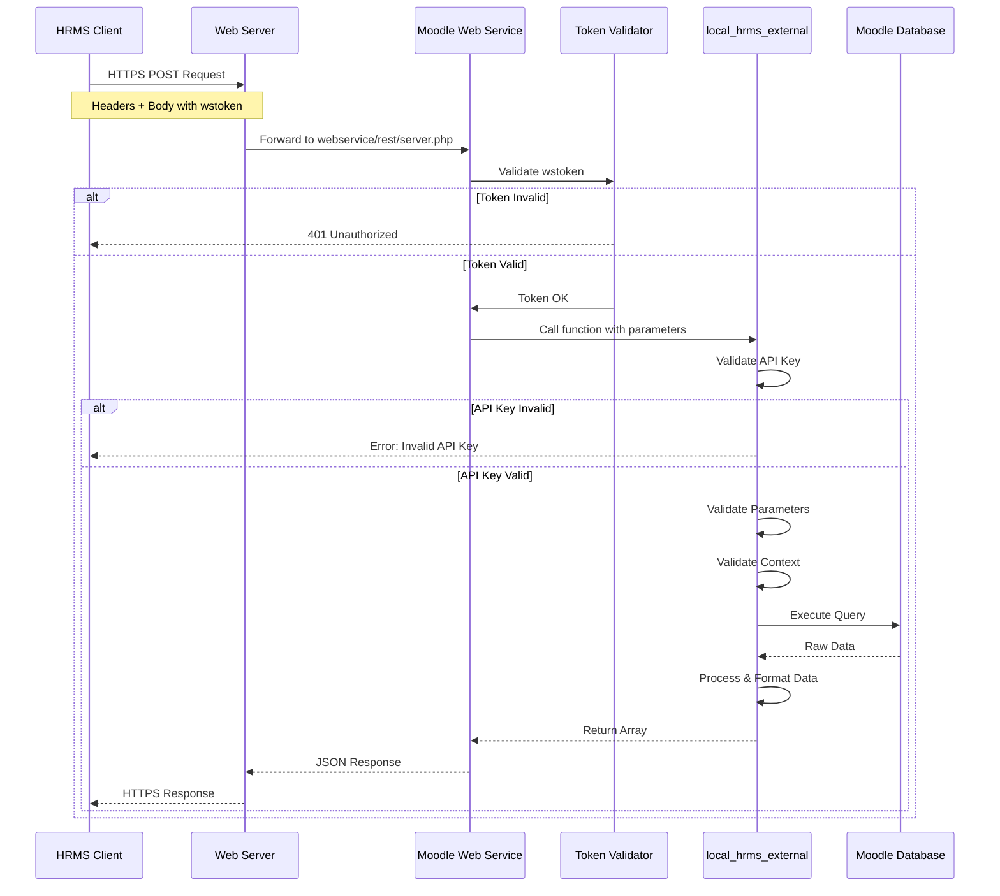
```mermaid
sequenceDiagram
    participant Client as HRMS Client
    participant Server as Web Server
    participant WS as Moodle Web Service
    participant Token as Token Validator
    participant API as local_hrms_external
    participant DB as Moodle Database
    
    Client->>Server: HTTPS POST Request
    Note over Client,Server: Headers + Body with wstoken
    
    Server->>WS: Forward to webservice/rest/server.php
    
    WS->>Token: Validate wstoken
    
    alt Token Invalid
        Token-->>Client: 401 Unauthorized
    else Token Valid
        Token->>WS: Token OK
        WS->>API: Call function with parameters
        
        API->>API: Validate API Key
        
        alt API Key Invalid
            API-->>Client: Error: Invalid API Key
        else API Key Valid
            API->>API: Validate Parameters
            API->>API: Validate Context
            
            API->>DB: Execute Query
            DB-->>API: Raw Data
            
            API->>API: Process & Format Data
            
            API-->>WS: Return Array
            WS-->>Server: JSON Response
            Server-->>Client: HTTPS Response
        end
    end
```

---

## 2. Get Active Courses Flow

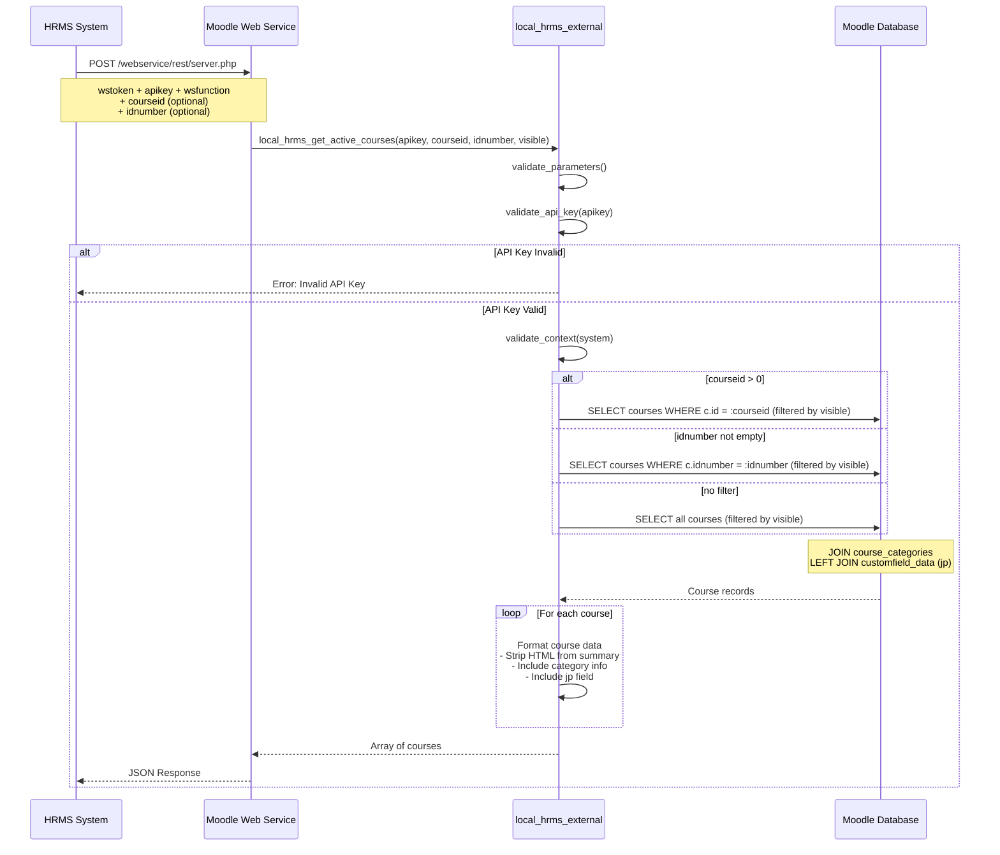
```mermaid
sequenceDiagram
    participant HRMS as HRMS System
    participant WS as Moodle Web Service
    participant API as local_hrms_external
    participant DB as Moodle Database
    
    HRMS->>WS: POST /webservice/rest/server.php
    Note over HRMS,WS: wstoken + apikey + wsfunction<br/>+ courseid (optional)<br/>+ idnumber (optional)
    
    WS->>API: local_hrms_get_active_courses(apikey, courseid, idnumber, visible)
    
    API->>API: validate_parameters()
    API->>API: validate_api_key(apikey)
    
    alt API Key Invalid
        API-->>HRMS: Error: Invalid API Key
    else API Key Valid
        API->>API: validate_context(system)
        
        alt courseid > 0
            API->>DB: SELECT courses WHERE c.id = :courseid (filtered by visible)
        else idnumber not empty
            API->>DB: SELECT courses WHERE c.idnumber = :idnumber (filtered by visible)
        else no filter
            API->>DB: SELECT all courses (filtered by visible)
        end
        
        Note over DB: JOIN course_categories<br/>LEFT JOIN customfield_data (jp)
        DB-->>API: Course records
        
        loop For each course
            API->>API: Format course data<br/>- Strip HTML from summary<br/>- Include category info<br/>- Include jp field
        end
        
        API-->>WS: Array of courses
        WS-->>HRMS: JSON Response
    end
```

### Detailed Flow with Validation

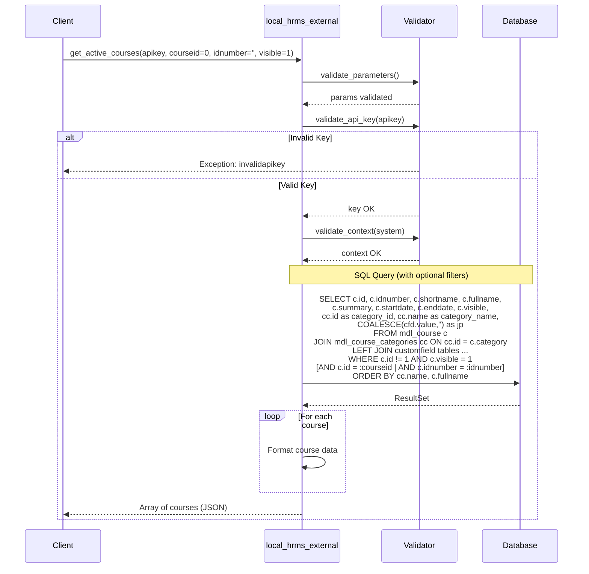
```mermaid
sequenceDiagram
    participant Client
    participant API as local_hrms_external
    participant Validator
    participant DB as Database
    
    Client->>API: get_active_courses(apikey, courseid=0, idnumber='', visible=1)
    
    API->>Validator: validate_parameters()
    Validator-->>API: params validated
    
    API->>Validator: validate_api_key(apikey)
    
    alt Invalid Key
        Validator-->>Client: Exception: invalidapikey
    else Valid Key
        Validator-->>API: key OK
        
        API->>Validator: validate_context(system)
        Validator-->>API: context OK
        
        Note over API,DB: SQL Query (with optional filters)
        API->>DB: SELECT c.id, c.idnumber, c.shortname, c.fullname,<br/>c.summary, c.startdate, c.enddate, c.visible,<br/>cc.id as category_id, cc.name as category_name,<br/>COALESCE(cfd.value,'') as jp<br/>FROM mdl_course c<br/>JOIN mdl_course_categories cc ON cc.id = c.category<br/>LEFT JOIN customfield tables ...<br/>WHERE c.id != 1 AND c.visible = 1<br/>[AND c.id = :courseid | AND c.idnumber = :idnumber]<br/>ORDER BY cc.name, c.fullname
        
        DB-->>API: ResultSet
        
        loop For each course
            API->>API: Format course data
        end
        
        API-->>Client: Array of courses (JSON)
    end
```

---

## 3. Get Course Participants Flow

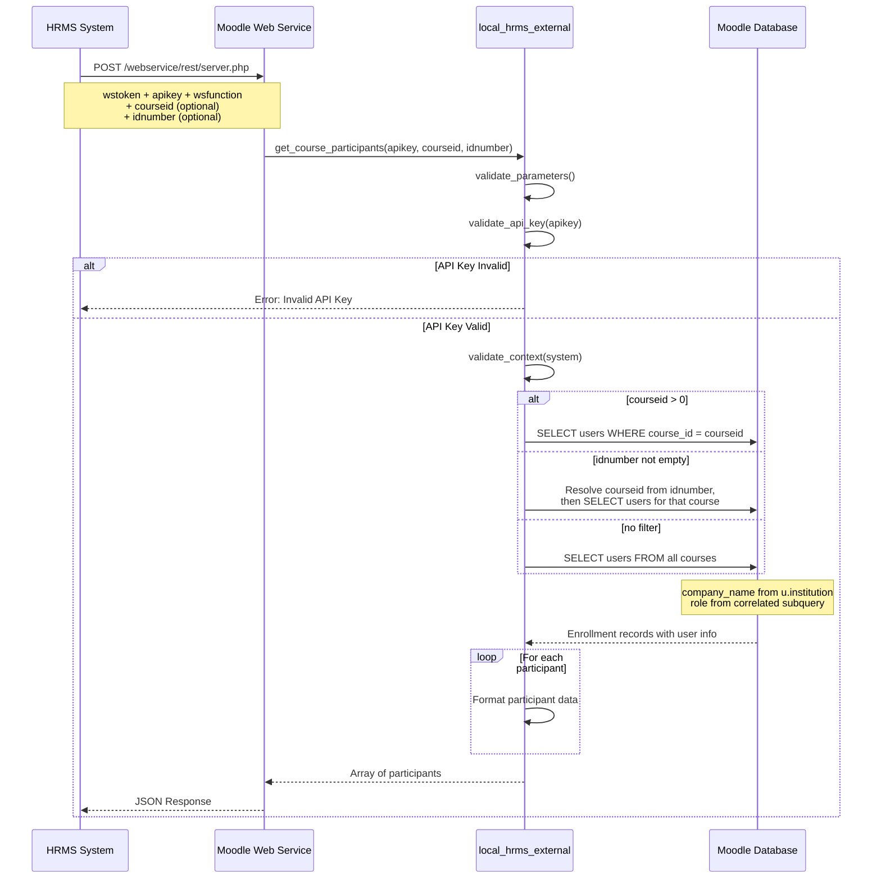
```mermaid
sequenceDiagram
    participant HRMS as HRMS System
    participant WS as Moodle Web Service
    participant API as local_hrms_external
    participant DB as Moodle Database
    
    HRMS->>WS: POST /webservice/rest/server.php
    Note over HRMS,WS: wstoken + apikey + wsfunction<br/>+ courseid (optional)<br/>+ idnumber (optional)
    
    WS->>API: get_course_participants(apikey, courseid, idnumber)
    
    API->>API: validate_parameters()
    API->>API: validate_api_key(apikey)
    
    alt API Key Invalid
        API-->>HRMS: Error: Invalid API Key
    else API Key Valid
        API->>API: validate_context(system)
        
        alt courseid > 0
            API->>DB: SELECT users WHERE course_id = courseid
        else idnumber not empty
            API->>DB: Resolve courseid from idnumber,<br/>then SELECT users for that course
        else no filter
            API->>DB: SELECT users FROM all courses
        end
        
        Note over DB: company_name from u.institution<br/>role from correlated subquery
        DB-->>API: Enrollment records with user info
        
        loop For each participant
            API->>API: Format participant data
        end
        
        API-->>WS: Array of participants
        WS-->>HRMS: JSON Response
    end
```

### Detailed Flow with Filtering

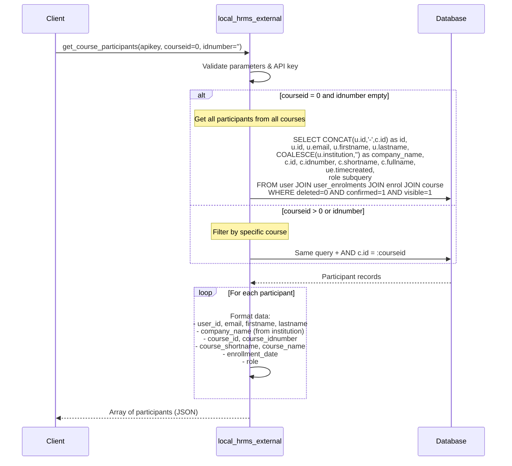
```mermaid
sequenceDiagram
    participant Client
    participant API as local_hrms_external
    participant DB as Database
    
    Client->>API: get_course_participants(apikey, courseid=0, idnumber='')
    
    API->>API: Validate parameters & API key
    
    alt courseid = 0 and idnumber empty
        Note over API: Get all participants from all courses
        API->>DB: SELECT CONCAT(u.id,'-',c.id) as id,<br/>u.id, u.email, u.firstname, u.lastname,<br/>COALESCE(u.institution,'') as company_name,<br/>c.id, c.idnumber, c.shortname, c.fullname,<br/>ue.timecreated,<br/>role subquery<br/>FROM user JOIN user_enrolments JOIN enrol JOIN course<br/>WHERE deleted=0 AND confirmed=1 AND visible=1
    else courseid > 0 or idnumber
        Note over API: Filter by specific course
        API->>DB: Same query + AND c.id = :courseid
    end
    
    DB-->>API: Participant records
    
    loop For each participant
        API->>API: Format data:<br/>- user_id, email, firstname, lastname<br/>- company_name (from institution)<br/>- course_id, course_idnumber<br/>- course_shortname, course_name<br/>- enrollment_date<br/>- role
    end
    
    API-->>Client: Array of participants (JSON)
```
```

---

## 4. Get Course Results Flow

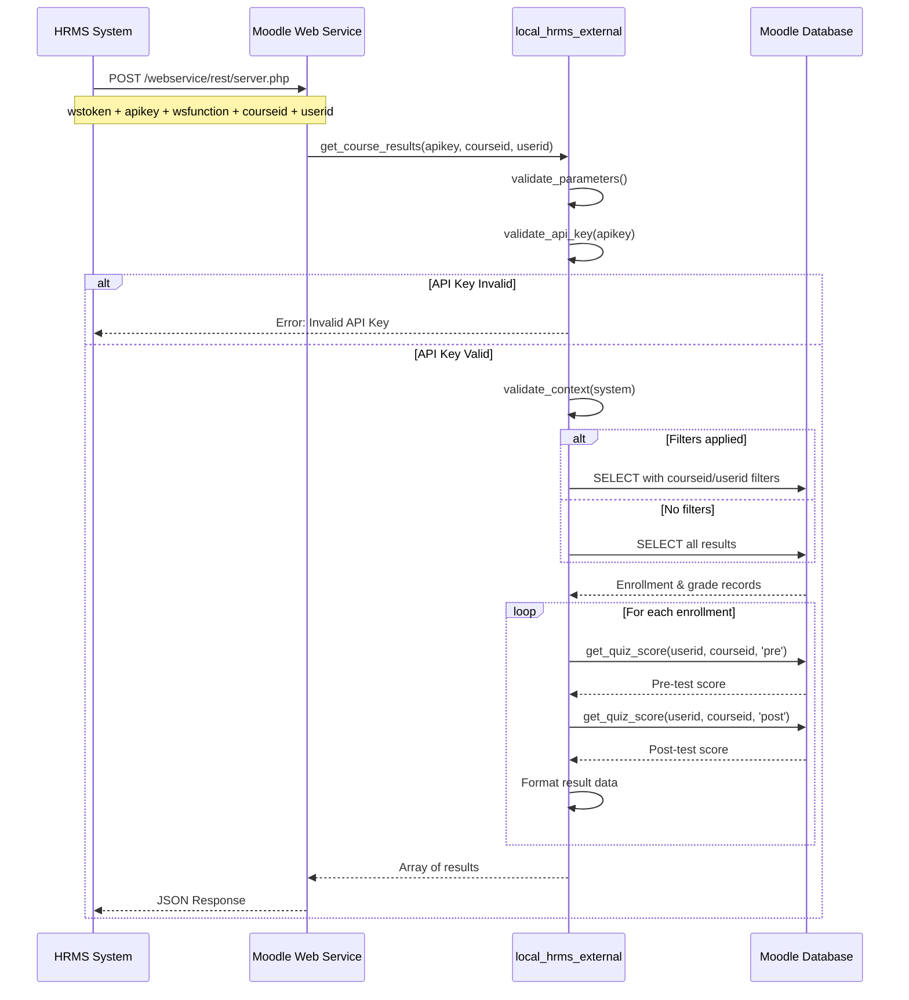
```mermaid
sequenceDiagram
    participant HRMS as HRMS System
    participant WS as Moodle Web Service
    participant API as local_hrms_external
    participant DB as Moodle Database
    
    HRMS->>WS: POST /webservice/rest/server.php
    Note over HRMS,WS: wstoken + apikey + wsfunction + courseid + userid
    
    WS->>API: get_course_results(apikey, courseid, userid)
    
    API->>API: validate_parameters()
    API->>API: validate_api_key(apikey)
    
    alt API Key Invalid
        API-->>HRMS: Error: Invalid API Key
    else API Key Valid
        API->>API: validate_context(system)
        
        alt Filters applied
            API->>DB: SELECT with courseid/userid filters
        else No filters
            API->>DB: SELECT all results
        end
        
        DB-->>API: Enrollment & grade records
        
        loop For each enrollment
            API->>DB: get_quiz_score(userid, courseid, 'pre')
            DB-->>API: Pre-test score
            
            API->>DB: get_quiz_score(userid, courseid, 'post')
            DB-->>API: Post-test score
            
            API->>API: Format result data
        end
        
        API-->>WS: Array of results
        WS-->>HRMS: JSON Response
    end
```

### Detailed Flow with Score Calculation

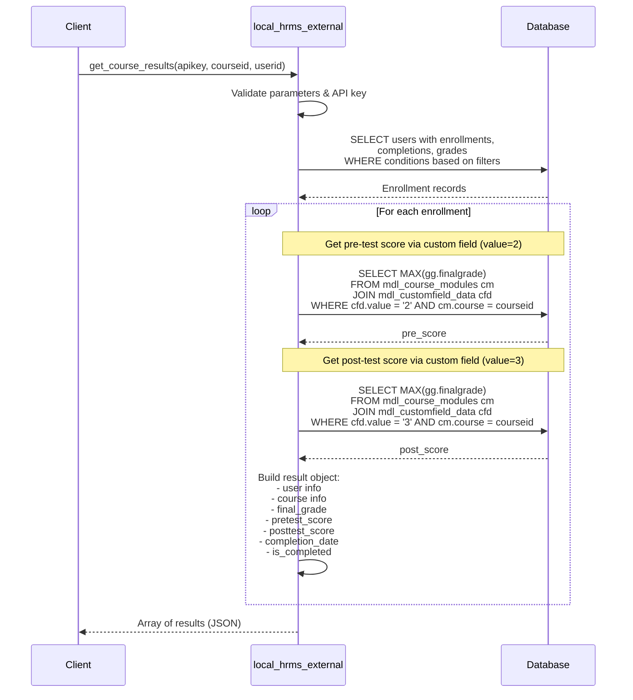
```mermaid
sequenceDiagram
    participant Client
    participant API as local_hrms_external
    participant DB as Database
    
    Client->>API: get_course_results(apikey, courseid, userid)
    
    API->>API: Validate parameters & API key
    
    API->>DB: SELECT users with enrollments,<br/>completions, grades<br/>WHERE conditions based on filters
    
    DB-->>API: Enrollment records
    
    loop For each enrollment
        Note over API,DB: Get pre-test score via custom field (value=2)
        API->>DB: SELECT MAX(gg.finalgrade)<br/>FROM mdl_course_modules cm<br/>JOIN mdl_customfield_data cfd<br/>WHERE cfd.value = '2' AND cm.course = courseid
        DB-->>API: pre_score
        
        Note over API,DB: Get post-test score via custom field (value=3)
        API->>DB: SELECT MAX(gg.finalgrade)<br/>FROM mdl_course_modules cm<br/>JOIN mdl_customfield_data cfd<br/>WHERE cfd.value = '3' AND cm.course = courseid
        DB-->>API: post_score
        
        API->>API: Build result object:<br/>- user info<br/>- course info<br/>- final_grade<br/>- pretest_score<br/>- posttest_score<br/>- completion_date<br/>- is_completed
    end
    
    API-->>Client: Array of results (JSON)
```

---

## 5. Get Users Flow

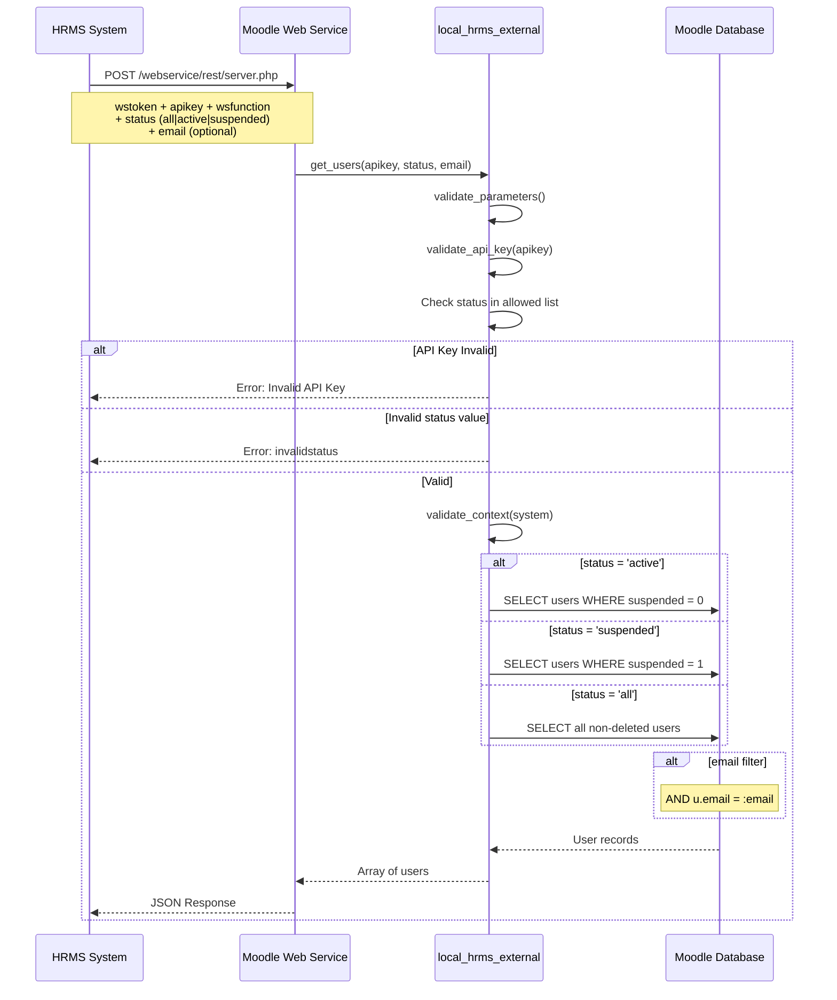
```mermaid
sequenceDiagram
    participant HRMS as HRMS System
    participant WS as Moodle Web Service
    participant API as local_hrms_external
    participant DB as Moodle Database
    
    HRMS->>WS: POST /webservice/rest/server.php
    Note over HRMS,WS: wstoken + apikey + wsfunction<br/>+ status (all|active|suspended)<br/>+ email (optional)
    
    WS->>API: get_users(apikey, status, email)
    
    API->>API: validate_parameters()
    API->>API: validate_api_key(apikey)
    API->>API: Check status in allowed list
    
    alt API Key Invalid
        API-->>HRMS: Error: Invalid API Key
    else Invalid status value
        API-->>HRMS: Error: invalidstatus
    else Valid
        API->>API: validate_context(system)
        
        alt status = 'active'
            API->>DB: SELECT users WHERE suspended = 0
        else status = 'suspended'
            API->>DB: SELECT users WHERE suspended = 1
        else status = 'all'
            API->>DB: SELECT all non-deleted users
        end
        
        alt email filter
            Note over DB: AND u.email = :email
        end
        
        DB-->>API: User records
        
        API-->>WS: Array of users
        WS-->>HRMS: JSON Response
    end
```

---

## 6. Get Course Progress Flow

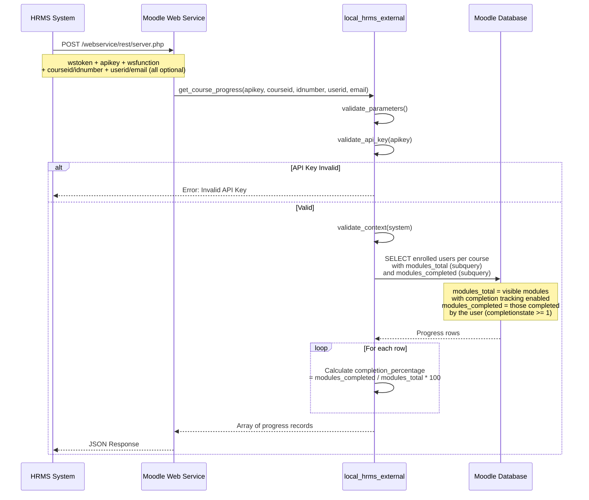
```mermaid
sequenceDiagram
    participant HRMS as HRMS System
    participant WS as Moodle Web Service
    participant API as local_hrms_external
    participant DB as Moodle Database
    
    HRMS->>WS: POST /webservice/rest/server.php
    Note over HRMS,WS: wstoken + apikey + wsfunction<br/>+ courseid/idnumber + userid/email (all optional)
    
    WS->>API: get_course_progress(apikey, courseid, idnumber, userid, email)
    
    API->>API: validate_parameters()
    API->>API: validate_api_key(apikey)
    
    alt API Key Invalid
        API-->>HRMS: Error: Invalid API Key
    else Valid
        API->>API: validate_context(system)
        
        API->>DB: SELECT enrolled users per course<br/>with modules_total (subquery)<br/>and modules_completed (subquery)
        Note over DB: modules_total = visible modules<br/>with completion tracking enabled<br/>modules_completed = those completed<br/>by the user (completionstate >= 1)
        
        DB-->>API: Progress rows
        
        loop For each row
            API->>API: Calculate completion_percentage<br/>= modules_completed / modules_total * 100
        end
        
        API-->>WS: Array of progress records
        WS-->>HRMS: JSON Response
    end
```

---

## 7. Questionnaire Scoring Flow

### Complete Questionnaire Analysis Process

```mermaid
sequenceDiagram
    participant API as get_questionnaire_scores()
    participant DB as Database
    
    Note over API: Initialize default response:<br/>all scores = 0, available = 0
    
    API->>DB: Find questionnaire module
    Note over DB: SELECT cm.id, q.id<br/>FROM course_modules cm<br/>JOIN modules m (name='questionnaire')<br/>JOIN questionnaire q<br/>WHERE course = courseid AND visible = 1
    
    alt No questionnaire found
        DB-->>API: NULL
        API-->>API: Return default (all zeros)
    else Questionnaire exists
        DB-->>API: questionnaire_id
        
        API->>DB: Find Rate question (type_id=8)
        Note over DB: SELECT * FROM questionnaire_question<br/>WHERE surveyid = questionnaire_id<br/>AND type_id = 8 (QUESRATE)
        
        alt No Rate question
            DB-->>API: NULL
            API-->>API: Return default (all zeros)
        else Rate question found
            DB-->>API: rate_question_id
            
            API->>DB: Count choices
            Note over DB: SELECT COUNT(*)<br/>FROM questionnaire_quest_choice<br/>WHERE question_id = rate_question_id
            DB-->>API: choice_count
            
            API->>DB: Get user's response
            Note over DB: SELECT * FROM questionnaire_response<br/>WHERE questionnaireid = questionnaire_id<br/>AND userid = userid
            
            alt No response from user
                DB-->>API: NULL
                API-->>API: Return default (all zeros)
            else Response exists
                DB-->>API: response_id
                
                API->>DB: Get all rating values
                Note over DB: SELECT qrr.rankvalue<br/>FROM questionnaire_response_rank qrr<br/>JOIN questionnaire_quest_choice qqc<br/>WHERE response_id = response_id<br/>AND question_id = rate_question_id<br/>ORDER BY qqc.id ASC
                
                DB-->>API: Array of rankvalues [v1, v2, ..., vN]
                
                alt Empty responses
                    API-->>API: Return default (all zeros)
                else Has responses
                    API->>API: Calculate score_total = average(all values)
                    
                    alt Response count != choice count
                        Note over API: Mismatch detected
                        API-->>API: Return {
                            questionnaire_available: 1 if total > 0,
                            score_materi: 0,
                            score_trainer: 0,
                            score_fasilitas: 0,
                            score_total: calculated
                        }
                    else choice_count == 9
                        Note over API: Perfect match with 9 choices
                        API->>API: score_materi = avg(v1, v2, v3)
                        API->>API: score_trainer = avg(v4, v5, v6)
                        API->>API: score_fasilitas = avg(v7, v8, v9)
                        API-->>API: Return {
                            questionnaire_available: 1,
                            score_materi: calculated,
                            score_trainer: calculated,
                            score_fasilitas: calculated,
                            score_total: calculated
                        }
                    else Other choice count
                        Note over API: Valid but not 9 choices
                        API-->>API: Return {
                            questionnaire_available: 1 if total > 0,
                            score_materi: 0,
                            score_trainer: 0,
                            score_fasilitas: 0,
                            score_total: calculated
                        }
                    end
                end
            end
        end
    end
```

### Questionnaire Scoring Decision Tree

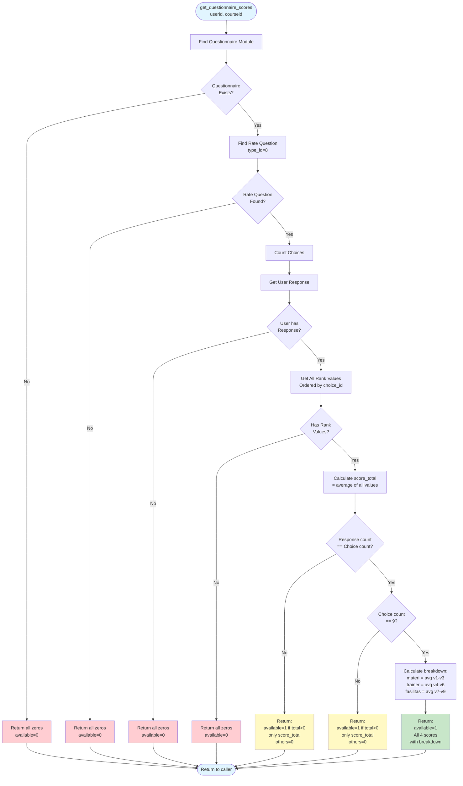
```mermaid
flowchart TD
    Start([get_questionnaire_scores<br/>userid, courseid]) --> FindQ[Find Questionnaire Module]
    
    FindQ --> HasQ{Questionnaire<br/>Exists?}
    HasQ -->|No| ReturnZero1[Return all zeros<br/>available=0]
    HasQ -->|Yes| FindRate[Find Rate Question<br/>type_id=8]
    
    FindRate --> HasRate{Rate Question<br/>Found?}
    HasRate -->|No| ReturnZero2[Return all zeros<br/>available=0]
    HasRate -->|Yes| CountChoice[Count Choices]
    
    CountChoice --> GetResp[Get User Response]
    
    GetResp --> HasResp{User has<br/>Response?}
    HasResp -->|No| ReturnZero3[Return all zeros<br/>available=0]
    HasResp -->|Yes| GetRank[Get All Rank Values<br/>Ordered by choice_id]
    
    GetRank --> HasRank{Has Rank<br/>Values?}
    HasRank -->|No| ReturnZero4[Return all zeros<br/>available=0]
    HasRank -->|Yes| CalcTotal[Calculate score_total<br/>= average of all values]
    
    CalcTotal --> CheckMatch{Response count<br/>== Choice count?}
    CheckMatch -->|No| ReturnTotal1[Return:<br/>available=1 if total>0<br/>only score_total<br/>others=0]
    
    CheckMatch -->|Yes| Check9{Choice count<br/>== 9?}
    Check9 -->|No| ReturnTotal2[Return:<br/>available=1 if total>0<br/>only score_total<br/>others=0]
    
    Check9 -->|Yes| CalcBreakdown[Calculate breakdown:<br/>materi = avg v1-v3<br/>trainer = avg v4-v6<br/>fasilitas = avg v7-v9]
    
    CalcBreakdown --> ReturnAll[Return:<br/>available=1<br/>All 4 scores<br/>with breakdown]
    
    ReturnZero1 --> End([Return to caller])
    ReturnZero2 --> End
    ReturnZero3 --> End
    ReturnZero4 --> End
    ReturnTotal1 --> End
    ReturnTotal2 --> End
    ReturnAll --> End
    
    style Start fill:#e1f5ff
    style End fill:#e1f5ff
    style ReturnAll fill:#c8e6c9
    style ReturnTotal1 fill:#fff9c4
    style ReturnTotal2 fill:#fff9c4
    style ReturnZero1 fill:#ffcdd2
    style ReturnZero2 fill:#ffcdd2
    style ReturnZero3 fill:#ffcdd2
    style ReturnZero4 fill:#ffcdd2
```

---

## 8. User Management Flows

### set_user_suspension

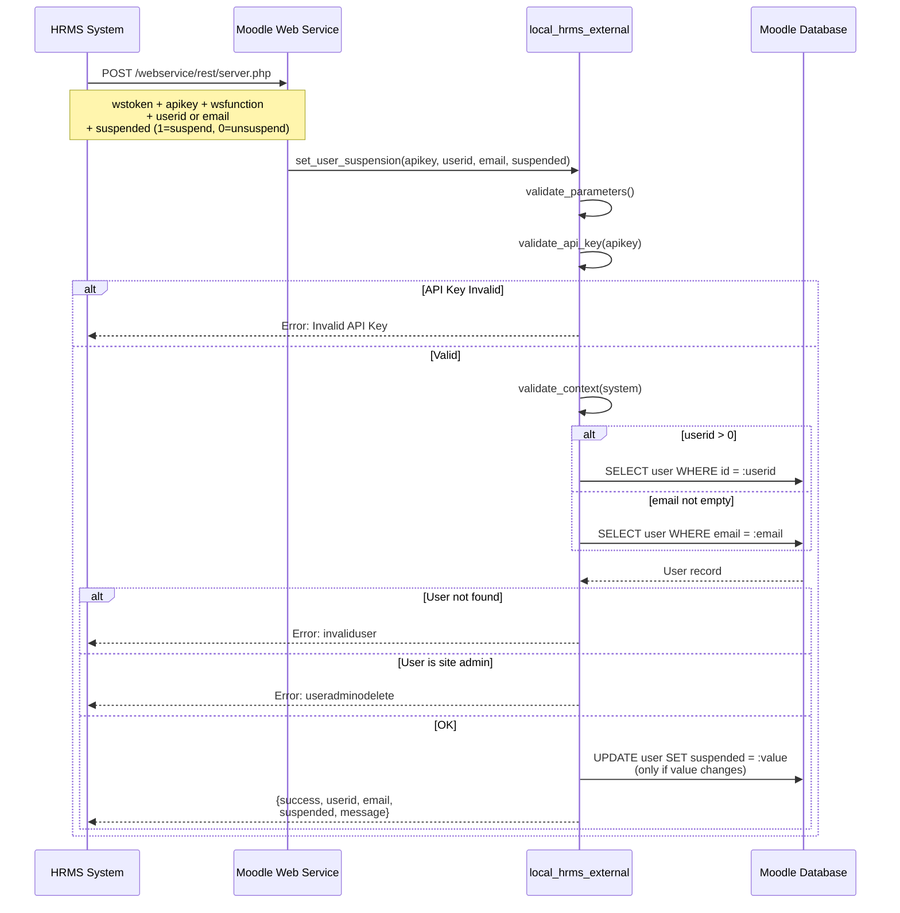
```mermaid
sequenceDiagram
    participant HRMS as HRMS System
    participant WS as Moodle Web Service
    participant API as local_hrms_external
    participant DB as Moodle Database
    
    HRMS->>WS: POST /webservice/rest/server.php
    Note over HRMS,WS: wstoken + apikey + wsfunction<br/>+ userid or email<br/>+ suspended (1=suspend, 0=unsuspend)
    
    WS->>API: set_user_suspension(apikey, userid, email, suspended)
    
    API->>API: validate_parameters()
    API->>API: validate_api_key(apikey)
    
    alt API Key Invalid
        API-->>HRMS: Error: Invalid API Key
    else Valid
        API->>API: validate_context(system)
        
        alt userid > 0
            API->>DB: SELECT user WHERE id = :userid
        else email not empty
            API->>DB: SELECT user WHERE email = :email
        end
        
        DB-->>API: User record
        
        alt User not found
            API-->>HRMS: Error: invaliduser
        else User is site admin
            API-->>HRMS: Error: useradminodelete
        else OK
            API->>DB: UPDATE user SET suspended = :value<br/>(only if value changes)
            API-->>HRMS: {success, userid, email,<br/>suspended, message}
        end
    end
```

### create_user

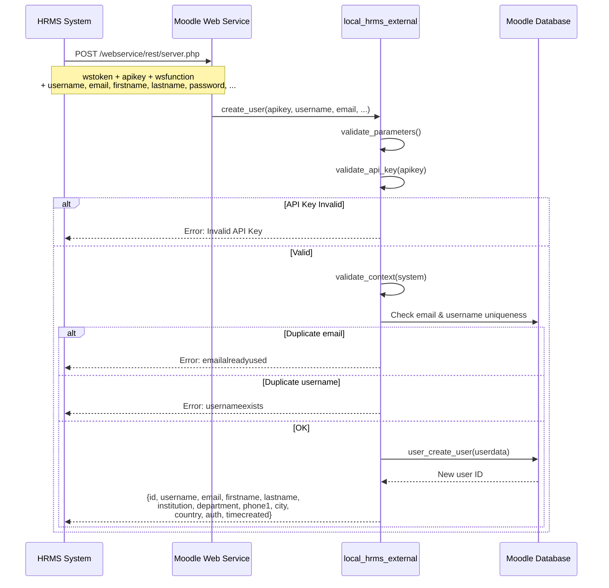
```mermaid
sequenceDiagram
    participant HRMS as HRMS System
    participant WS as Moodle Web Service
    participant API as local_hrms_external
    participant DB as Moodle Database
    
    HRMS->>WS: POST /webservice/rest/server.php
    Note over HRMS,WS: wstoken + apikey + wsfunction<br/>+ username, email, firstname, lastname, password, ...
    
    WS->>API: create_user(apikey, username, email, ...)
    
    API->>API: validate_parameters()
    API->>API: validate_api_key(apikey)
    
    alt API Key Invalid
        API-->>HRMS: Error: Invalid API Key
    else Valid
        API->>API: validate_context(system)
        API->>DB: Check email & username uniqueness
        
        alt Duplicate email
            API-->>HRMS: Error: emailalreadyused
        else Duplicate username
            API-->>HRMS: Error: usernameexists
        else OK
            API->>DB: user_create_user(userdata)
            DB-->>API: New user ID
            API-->>HRMS: {id, username, email, firstname, lastname,<br/>institution, department, phone1, city,<br/>country, auth, timecreated}
        end
    end
```

### update_user

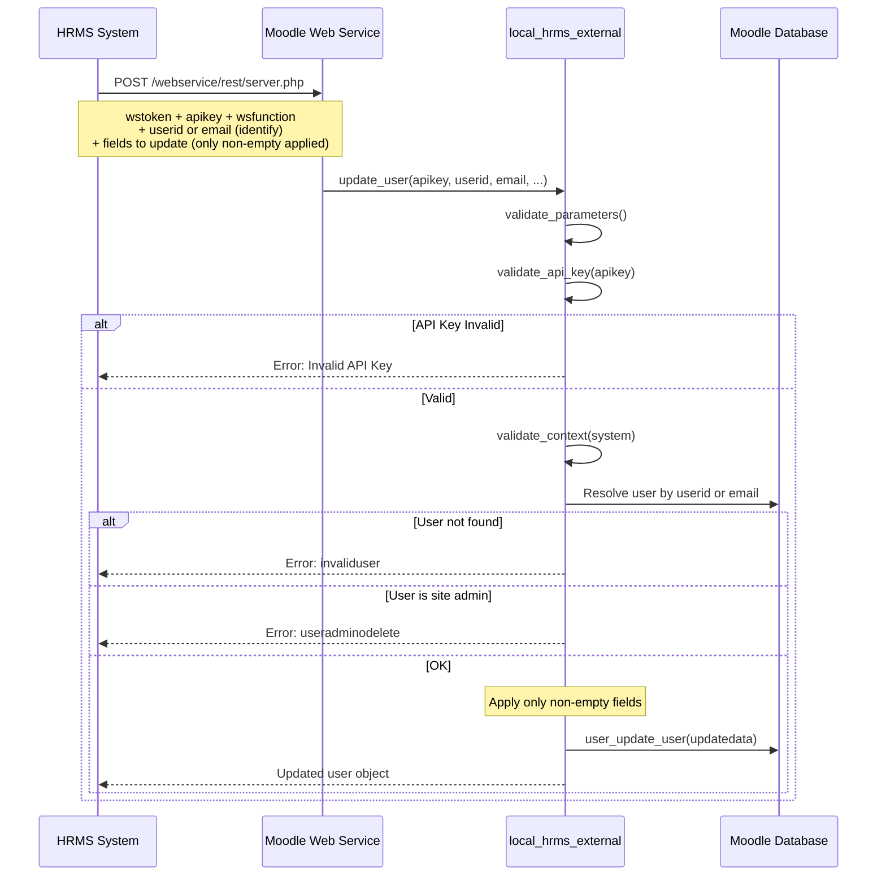
```mermaid
sequenceDiagram
    participant HRMS as HRMS System
    participant WS as Moodle Web Service
    participant API as local_hrms_external
    participant DB as Moodle Database
    
    HRMS->>WS: POST /webservice/rest/server.php
    Note over HRMS,WS: wstoken + apikey + wsfunction<br/>+ userid or email (identify)<br/>+ fields to update (only non-empty applied)
    
    WS->>API: update_user(apikey, userid, email, ...)
    
    API->>API: validate_parameters()
    API->>API: validate_api_key(apikey)
    
    alt API Key Invalid
        API-->>HRMS: Error: Invalid API Key
    else Valid
        API->>API: validate_context(system)
        API->>DB: Resolve user by userid or email
        
        alt User not found
            API-->>HRMS: Error: invaliduser
        else User is site admin
            API-->>HRMS: Error: useradminodelete
        else OK
            Note over API: Apply only non-empty fields
            API->>DB: user_update_user(updatedata)
            API-->>HRMS: Updated user object
        end
    end
```

---

## 9. Course Management Flows

### create_course

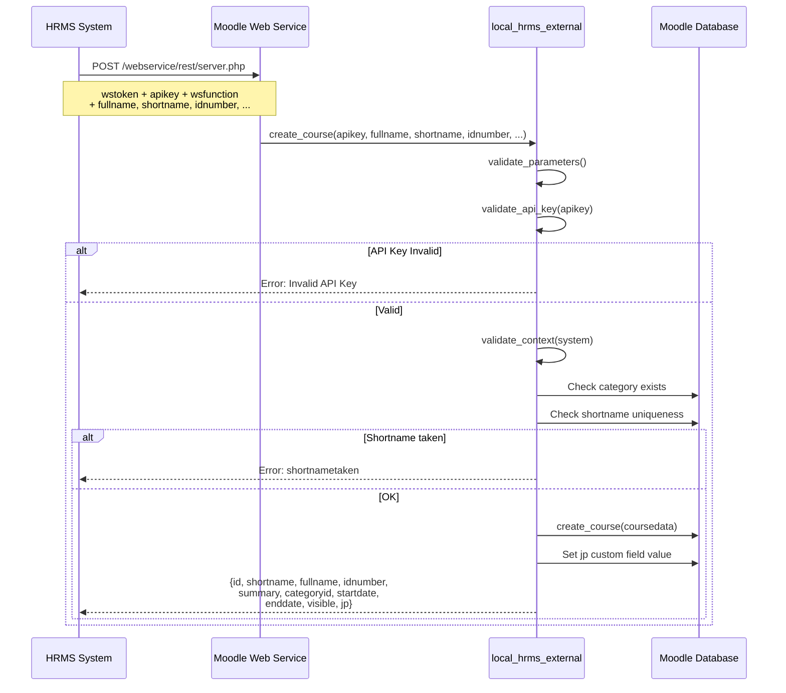
```mermaid
sequenceDiagram
    participant HRMS as HRMS System
    participant WS as Moodle Web Service
    participant API as local_hrms_external
    participant DB as Moodle Database
    
    HRMS->>WS: POST /webservice/rest/server.php
    Note over HRMS,WS: wstoken + apikey + wsfunction<br/>+ fullname, shortname, idnumber, ...
    
    WS->>API: create_course(apikey, fullname, shortname, idnumber, ...)
    
    API->>API: validate_parameters()
    API->>API: validate_api_key(apikey)
    
    alt API Key Invalid
        API-->>HRMS: Error: Invalid API Key
    else Valid
        API->>API: validate_context(system)
        API->>DB: Check category exists
        API->>DB: Check shortname uniqueness
        
        alt Shortname taken
            API-->>HRMS: Error: shortnametaken
        else OK
            API->>DB: create_course(coursedata)
            API->>DB: Set jp custom field value
            API-->>HRMS: {id, shortname, fullname, idnumber,<br/>summary, categoryid, startdate,<br/>enddate, visible, jp}
        end
    end
```

### update_course

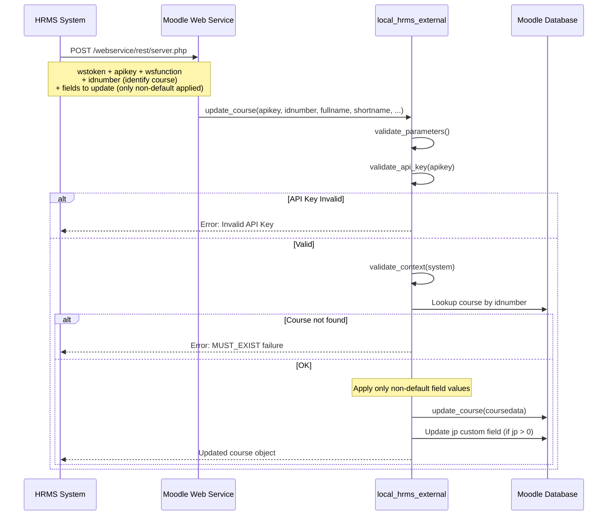
```mermaid
sequenceDiagram
    participant HRMS as HRMS System
    participant WS as Moodle Web Service
    participant API as local_hrms_external
    participant DB as Moodle Database
    
    HRMS->>WS: POST /webservice/rest/server.php
    Note over HRMS,WS: wstoken + apikey + wsfunction<br/>+ idnumber (identify course)<br/>+ fields to update (only non-default applied)
    
    WS->>API: update_course(apikey, idnumber, fullname, shortname, ...)
    
    API->>API: validate_parameters()
    API->>API: validate_api_key(apikey)
    
    alt API Key Invalid
        API-->>HRMS: Error: Invalid API Key
    else Valid
        API->>API: validate_context(system)
        API->>DB: Lookup course by idnumber
        
        alt Course not found
            API-->>HRMS: Error: MUST_EXIST failure
        else OK
            Note over API: Apply only non-default field values
            API->>DB: update_course(coursedata)
            API->>DB: Update jp custom field (if jp > 0)
            API-->>HRMS: Updated course object
        end
    end
```

---

## 10. Enrolment Management Flows

### enrol_user

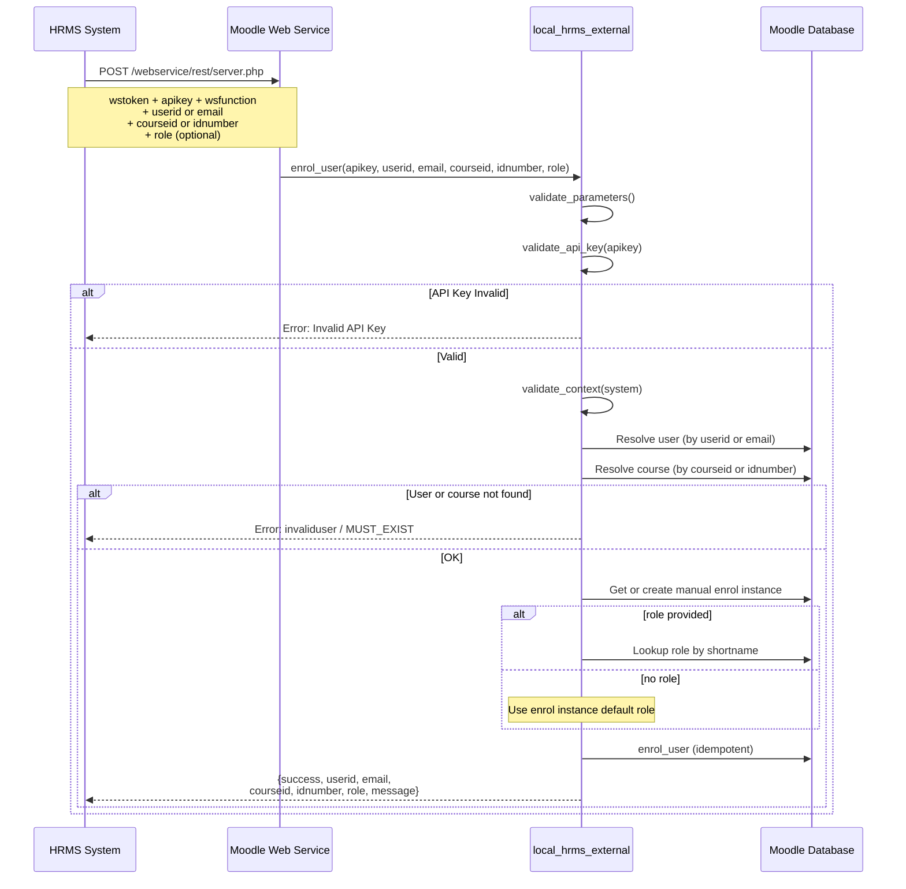
```mermaid
sequenceDiagram
    participant HRMS as HRMS System
    participant WS as Moodle Web Service
    participant API as local_hrms_external
    participant DB as Moodle Database
    
    HRMS->>WS: POST /webservice/rest/server.php
    Note over HRMS,WS: wstoken + apikey + wsfunction<br/>+ userid or email<br/>+ courseid or idnumber<br/>+ role (optional)
    
    WS->>API: enrol_user(apikey, userid, email, courseid, idnumber, role)
    
    API->>API: validate_parameters()
    API->>API: validate_api_key(apikey)
    
    alt API Key Invalid
        API-->>HRMS: Error: Invalid API Key
    else Valid
        API->>API: validate_context(system)
        API->>DB: Resolve user (by userid or email)
        API->>DB: Resolve course (by courseid or idnumber)
        
        alt User or course not found
            API-->>HRMS: Error: invaliduser / MUST_EXIST
        else OK
            API->>DB: Get or create manual enrol instance
            
            alt role provided
                API->>DB: Lookup role by shortname
            else no role
                Note over API: Use enrol instance default role
            end
            
            API->>DB: enrol_user (idempotent)
            API-->>HRMS: {success, userid, email,<br/>courseid, idnumber, role, message}
        end
    end
```

### unenrol_user

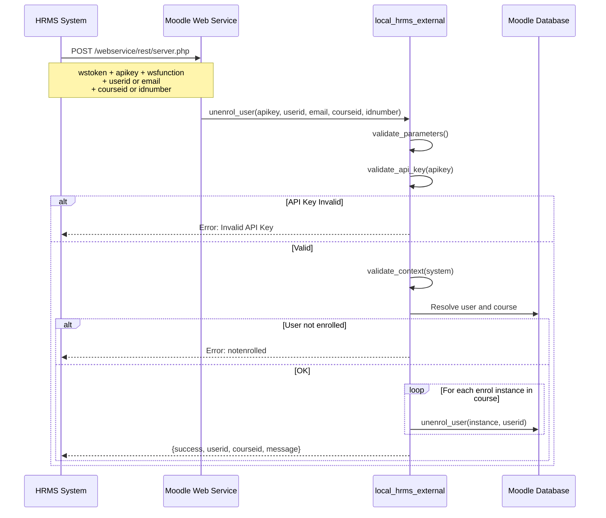
```mermaid
sequenceDiagram
    participant HRMS as HRMS System
    participant WS as Moodle Web Service
    participant API as local_hrms_external
    participant DB as Moodle Database
    
    HRMS->>WS: POST /webservice/rest/server.php
    Note over HRMS,WS: wstoken + apikey + wsfunction<br/>+ userid or email<br/>+ courseid or idnumber
    
    WS->>API: unenrol_user(apikey, userid, email, courseid, idnumber)
    
    API->>API: validate_parameters()
    API->>API: validate_api_key(apikey)
    
    alt API Key Invalid
        API-->>HRMS: Error: Invalid API Key
    else Valid
        API->>API: validate_context(system)
        API->>DB: Resolve user and course
        
        alt User not enrolled
            API-->>HRMS: Error: notenrolled
        else OK
            loop For each enrol instance in course
                API->>DB: unenrol_user(instance, userid)
            end
            API-->>HRMS: {success, userid, courseid, message}
        end
    end
```

---

## 11. Authentication Flow

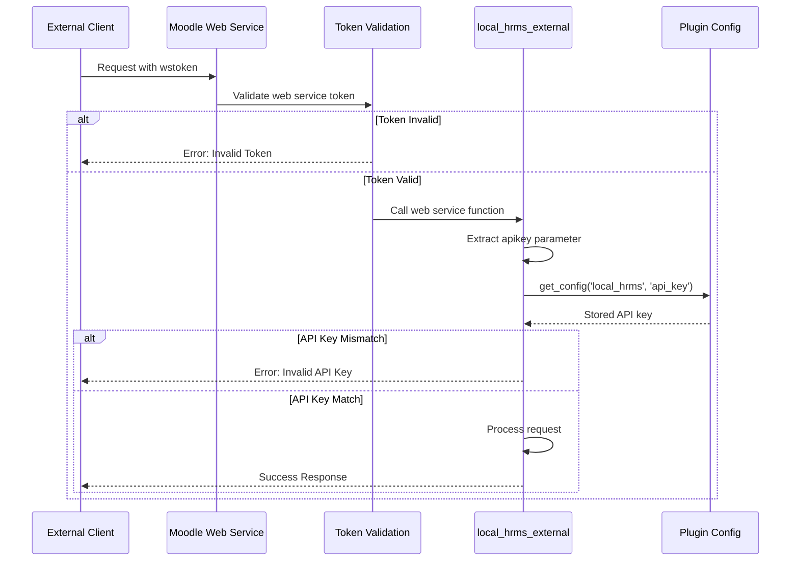
```mermaid
sequenceDiagram
    participant Client as External Client
    participant WS as Moodle Web Service
    participant Auth as Token Validation
    participant API as local_hrms_external
    participant Config as Plugin Config
    
    Client->>WS: Request with wstoken
    WS->>Auth: Validate web service token
    
    alt Token Invalid
        Auth-->>Client: Error: Invalid Token
    else Token Valid
        Auth->>API: Call web service function
        API->>API: Extract apikey parameter
        API->>Config: get_config('local_hrms', 'api_key')
        Config-->>API: Stored API key
        
        alt API Key Mismatch
            API-->>Client: Error: Invalid API Key
        else API Key Match
            API->>API: Process request
            API-->>Client: Success Response
        end
    end
```

### Detailed Authentication with User Context

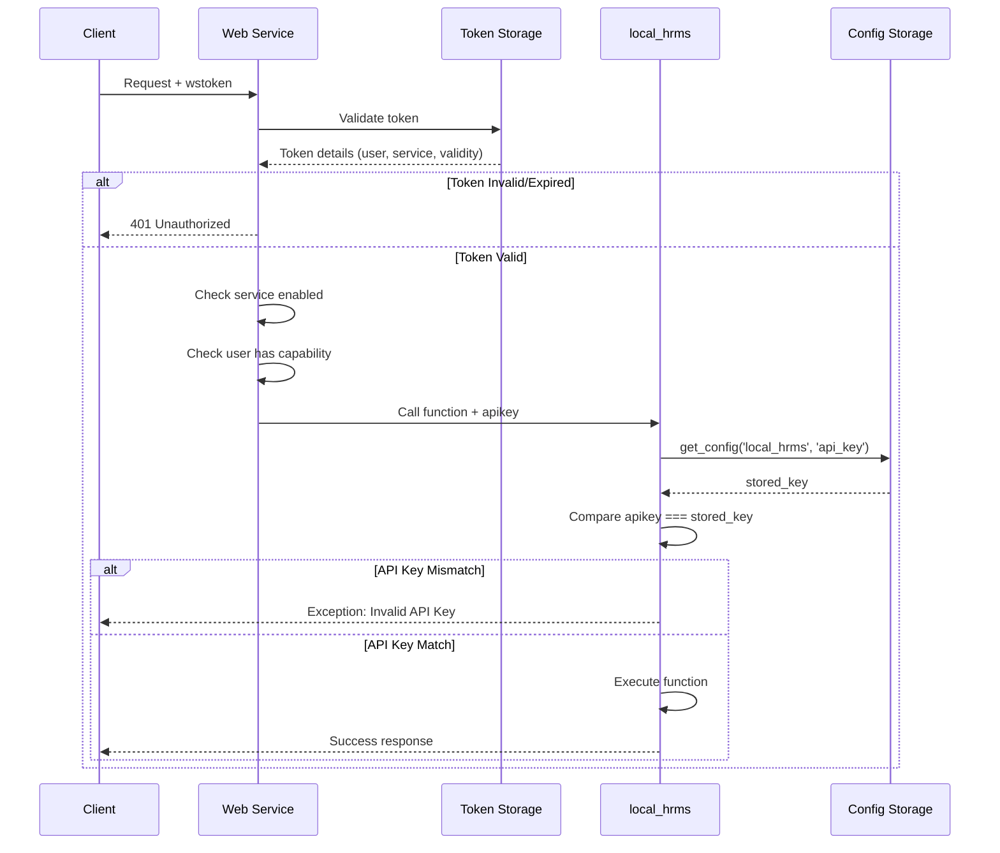
```mermaid
sequenceDiagram
    participant Client
    participant WS as Web Service
    participant TokenDB as Token Storage
    participant API as local_hrms
    participant ConfigDB as Config Storage
    
    Client->>WS: Request + wstoken
    
    WS->>TokenDB: Validate token
    TokenDB-->>WS: Token details (user, service, validity)
    
    alt Token Invalid/Expired
        WS-->>Client: 401 Unauthorized
    else Token Valid
        WS->>WS: Check service enabled
        WS->>WS: Check user has capability
        
        WS->>API: Call function + apikey
        
        API->>ConfigDB: get_config('local_hrms', 'api_key')
        ConfigDB-->>API: stored_key
        
        API->>API: Compare apikey === stored_key
        
        alt API Key Mismatch
            API-->>Client: Exception: Invalid API Key
        else API Key Match
            API->>API: Execute function
            API-->>Client: Success response
        end
    end
```

---

## 12. Error Handling Flow

```mermaid
sequenceDiagram
    participant Client
    participant WS as Web Service
    participant API as local_hrms
    
    Client->>WS: Request with invalid token
    WS->>WS: Validate token
    WS-->>Client: webservice_access_exception
    
    Client->>WS: Request with valid token
    WS->>API: Call function
    API->>API: Validate API key
    API-->>Client: moodle_exception: invalidapikey
    
    Client->>WS: Request with missing parameters
    WS->>API: Call function
    API->>API: validate_parameters()
    API-->>Client: invalid_parameter_exception
    
    Client->>WS: Valid request but no data
    WS->>API: Call function
    API->>API: Execute query
    API-->>Client: Empty array []
```

### Detailed Error Scenarios

```mermaid
sequenceDiagram
    participant Client
    participant WS as Web Service
    participant API as local_hrms_external
    participant DB as Database
    
    Note over Client,DB: Scenario 1: Invalid Token
    Client->>WS: POST with invalid wstoken
    WS->>WS: validate_token()
    WS-->>Client: 401 Unauthorized<br/>webservice_access_exception
    
    Note over Client,DB: Scenario 2: Invalid API Key
    Client->>WS: POST with valid wstoken, invalid apikey
    WS->>API: Call function
    API->>API: validate_api_key(apikey)
    API-->>Client: 403 Forbidden<br/>moodle_exception: invalidapikey
    
    Note over Client,DB: Scenario 3: Missing Required Parameter
    Client->>WS: POST without required parameter
    WS->>API: Call function
    API->>API: validate_parameters()
    API-->>Client: 400 Bad Request<br/>invalid_parameter_exception
    
    Note over Client,DB: Scenario 4: Database Error
    Client->>WS: POST with valid credentials
    WS->>API: Call function
    API->>DB: Execute query
    DB-->>API: SQL Error
    API-->>Client: 500 Internal Server Error<br/>dml_exception
    
    Note over Client,DB: Scenario 5: No Data Found
    Client->>WS: POST with valid credentials
    WS->>API: Call function
    API->>DB: Execute query
    DB-->>API: Empty ResultSet
    API->>API: Process results
    API-->>Client: 200 OK<br/>[] (empty array)
```

---

## Usage Instructions

### Viewing Diagrams

These diagrams use Mermaid syntax. To view them:

1. **GitHub**: GitHub automatically renders Mermaid diagrams in markdown files
2. **VS Code**: Install the "Markdown Preview Mermaid Support" extension
3. **Online**: Copy to [Mermaid Live Editor](https://mermaid.live/)
4. **Documentation Sites**: Use MkDocs with mermaid2 plugin

### Editing Diagrams

To modify these diagrams:

1. Use the Mermaid syntax reference: https://mermaid.js.org/
2. Test changes in the Mermaid Live Editor
3. Common elements:
   - `participant`: Define an actor in the sequence
   - `->`: Solid arrow (synchronous call)
   - `-->>`: Dashed arrow (return/response)
   - `Note over`: Add notes above actors
   - `alt/else/end`: Conditional logic
   - `loop/end`: Repetitive logic

### Exporting Diagrams

To export as images:

1. Use Mermaid CLI: `mmdc -i DIAGRAMS.md -o diagram.png`
2. Or use the Mermaid Live Editor's export function
3. Or use VS Code with Mermaid export extension

---

## Integration with Documentation

These diagrams are referenced in:
- [README.md](README.md) - Main documentation
- [DESIGN.md](DESIGN.md) - Detailed design documentation

---

**Last Updated**: 2026-03-25  
**Version**: 2.0  
**Author**: Prihantoosa

## Changelog

### Version 2.0 (2026-03-25)
- Renumbered all sections to accommodate new diagrams
- Section 2 (Get Active Courses): updated params (courseid, idnumber) and SQL
- Section 3 (Get Course Participants): updated params (idnumber), replaced user_info_data with u.institution, added role field
- Section 4 (Get Course Results): removed pre/post-test score sub-calls, added student role filter, added idnumber param
- Section 5 (Get Users): new diagram - list users with status/email filter
- Section 6 (Get Course Progress): new diagram - activity completion per enrolled user
- Section 7 (Questionnaire Scoring): renamed score_tempat → score_fasilitas throughout
- Section 8 (User Management): new diagrams for set_user_suspension, create_user, update_user
- Section 9 (Course Management): new diagrams for create_course, update_course
- Section 10 (Enrolment Management): new diagrams for enrol_user, unenrol_user
- Removed Section 5 (Get All Course Results) — function no longer a registered endpoint

### Version 1.1 (2026-02-01)
- Added Get All Course Results Flow with questionnaire integration
- Added comprehensive Questionnaire Scoring Flow with decision tree
- Added detailed sequence diagrams for questionnaire analysis
- Added flowchart for questionnaire scoring logic
- Updated all section numbering

### Version 1.0 (2025-01-05)
- Initial release with basic API flows
- Authentication and error handling diagrams
